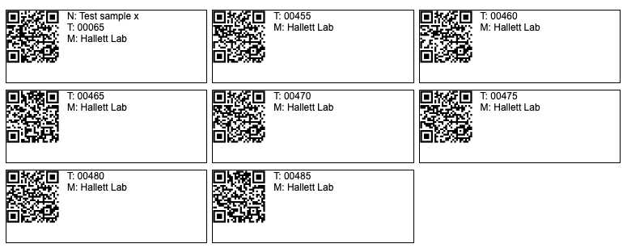
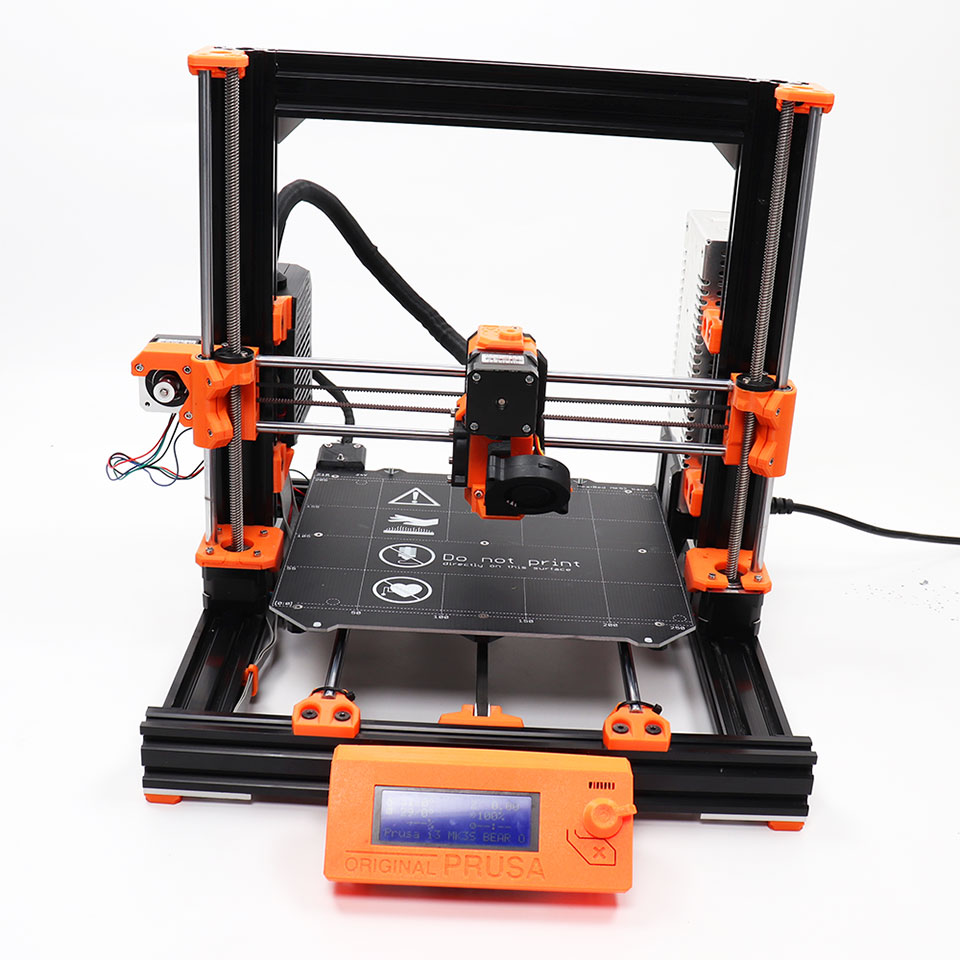
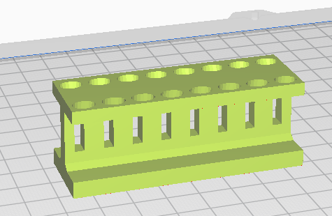
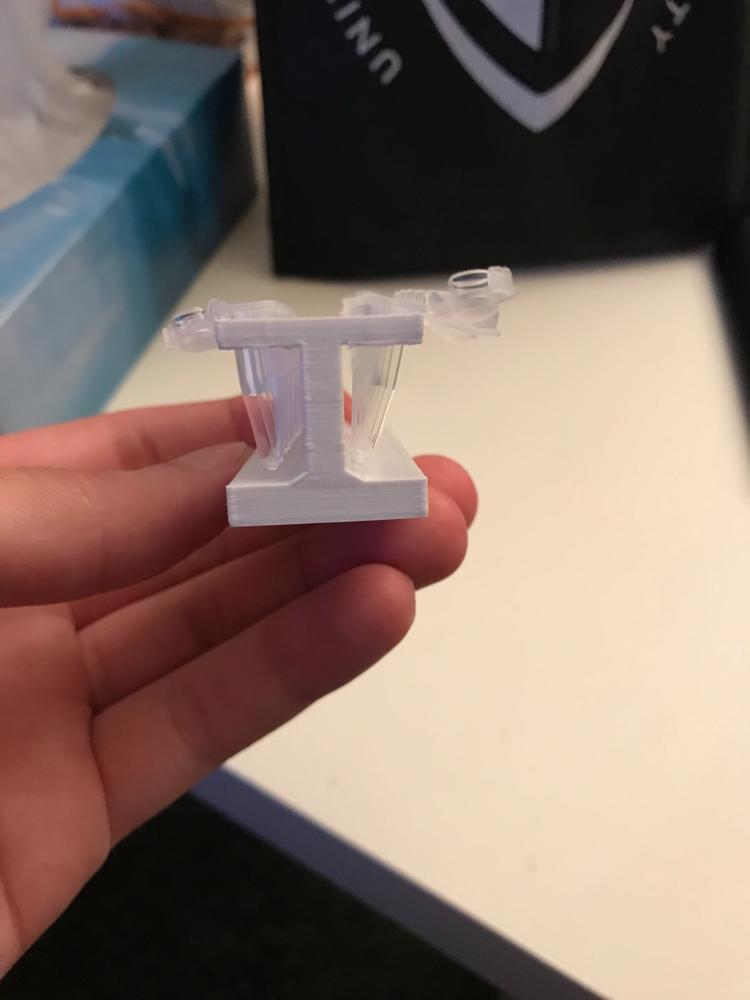
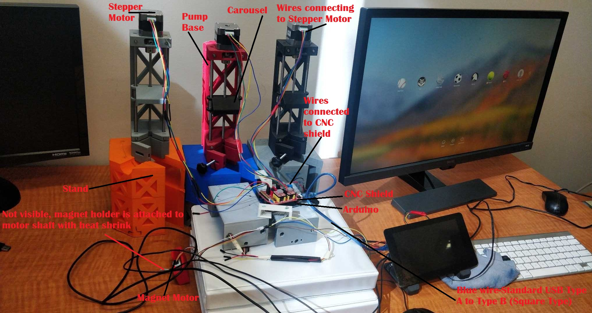
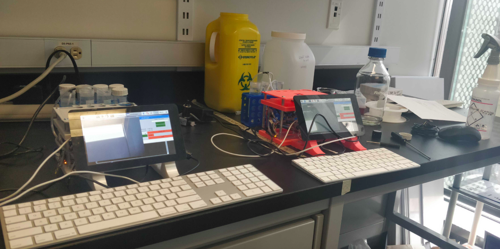
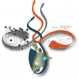

```{r setup, include=FALSE}
knitr::opts_chunk$set(echo = FALSE)
df <- data.frame( Phone = c( 'low', 'low', 'low', 'high', '\u23C0'),
                  Tablets_plus = c( 'low', 'low', 'low', 'high', '\u23C0'),
                  Laptop = c( 'med', 'med','med','high','\u23C0'),
                  Workstation = c( 'high', 'high','high','high','\u23C0'),
                  Server = c( 'v. high', 'v high', 'v. high', '\u23C0', 'high' ),
                  ComputeFarm = c( 'massive', 'massive', 'massive', '\u23C0', 'v. high' ))
                  
rownames(df)= c('Processors', 'Memory', 'Disk', 'Audio/Visual', 'Backup')
df.traditional <- df[, -c(1,2, ncol(df))]

```

## Outline for today

- Moving from traditional to modern computer infrastructure

- The cloud computing paradigm

- Our infrastructure

- Software and other resources for science management 

##  Traditional lab computational infrastructure


```{r echo=FALSE, reults = 'asis'}
library(knitr)
knitr::kable(df.traditional)
```

- Processors, typically CPUs, are the engine of the computer.  Speed is the rate they can execute instructions. To increase power of the system you buy faster CPUs, or increase the number of CPUs.

- Memory, typically Random Access Memory (RAM), stores the program and data that is currently executing on the processors. Large software or datasets $\Rightarrow$ More memory.

- Disk, typically local hard drives optimized for speed of access, store the programs, data, operating system etc. of your system. This information is shuttled to and from memory.

- Audio/visual includes output devices like monitors. 

- Backup refers to long term storage of data; sometimes called _cold storage_ as it is typicaly offline. Used for large files of raw data (eg sequence reads or mass spectrometry profiles).

- Servers are typically larger machines with many (eg ~100s) of CPUs, large memory reserves, and several terabypes of storage. The servers are typically physically located at the company or university. 

## Some reflection points for this traditional approach


- When a project needs a lot of computational resources,  you buy more hardware. And when that project ends?

- Hardware quickly becomes out of date and eventually obsolete. Cost of replacing equipment?

- Hardware is prone to failure, especially big systems. For example, in our old system, one drive (of ~200 drives total) died every month. Cost of replacement + cost of labour + lost time = ?

- How often do the machines sit idle? What is the average amount of time any computer is being used? 24/7? 

- How much time is spent updating software and operating systems across so many machines?

- How well integrated are the different components of your system?  For example, lack of a shared file system and inconsistencies between versioning of software between the laptop, workstation and server cause many problems.

- What about other lab tasks? Inventories? Lab notebooks? How do you share intellectual property such as talks, posters, papers, software?

## Towards a more modern approach

- I will describe how my lab evolved its computational infrastructure.

- Many alternatives and some things may not be appropriate for your work.


##  A more modern lab setup +1


```{r echo=FALSE, reults = 'asis'}
library(knitr)
knitr::kable(df[, -2])
```


- Compute farms are usually companies that offer processors, storage and backup remotely. They give labs essentially as much computing power as they need (if they can afford it).

- Cell phones are increasingly integrated into our lab. Here is one example.


- [<i class="fa fa-qrcode"></i> Snipe-It](https://snipeitapp.com/) We recently installed this system as a way to generate QR- or classic bar- codes.  You can purchase cheap special sticker paper that survives autoclaves and -80 freezers. You put the sticker on each item in your lab. The camera on your phone reeds the QR code and provides a web link to the item in a database. Great for tracking samples.

- Try the example on the next page.

## Example using SNIPE-IT 

Usually each of the QR-codes below would be printed out on sticky paper and attached to an object or sample (eg an Eppendorf). Try reading one code with your phone and look for the link.




##  A more modern lab setup +2


```{r echo=FALSE, reults = 'asis'}
library(knitr)
knitr::kable(df)
```

- Tablets, voice activated assistants and styli have been important additions for us. Here are two examples.

- <strong>Lab notebooks</strong>. Traditional pencil and paper approaches do have  limitations, primarily because the information is not immediately online in electronic format. Modern lab notebooks discussed in the two short papers in the Required Reading [E Pain (2019) Science](https://www.sciencemag.org/careers/2019/09/how-keep-lab-notebook) and [R Kwok (2018) Nature](https://www.nature.com/articles/d41586-018-05895-3). 

- I personally use a tool called  [<i class="fa fa-wrench"></i> Goodnotes](https://www.goodnotes.com). It has nice software for drawing on the screen, and integrates well across platforms. 
Others in my lab use [<i class="fa fa-wrench"></i> Evernote](https://www.evernote.com). Although I haven't used it, I hear very good things about
[<i class="fa fa-wrench"></i> Notion](https://notion.so/). This is software that really integrates many tools into one coherent framework. If everyone in a group is using the software, it is very easy to share notes, images, calendars, and other common information. As it is cloud based, the information is available anywhere to all members of the group.

- <strong>Electronic Assistants</strong> We recently installed  [<i class="fa fa-wrench"></i> LabTwin](https://www.labtwin.com/). LabTwin can be activated by voice via Siri, Alexa etc "hands-free" in the lab. It uses a robust artificial intelligence-supported interface to help you  record your notes, display protocols, coordinate experiments and provide information "on the fly". You can watch a short movie [here](https://www.youtube.com/watch?v=dFK4Yt7iXmc).


## 3D printers

Now an important component in modern labs. Many advantages: fix small broken parts, create new technologies very cheaply, and  promote a open DIY science mentality. 


<figure class="image">
<p float="left">
   
   
   
</p>
<figcaption><small> Left: Prusa 3D printer ($< \$1K$); Centre: Eppendorf stand design; Right: printed version ($< \$10$)</small> </figcaption>
</figure>

<figure class="image">
<p float="left">
   
   
</p>
<figcaption> <small>Left: Poseidon system (design from Lior Pachter's group at CalTech); Right: Samira and her Pink DROP-seq device) </small></figcaption>
</figure>

## Google Glasses and Virtual Reality (VR) equipment


 - Not yet, but coming ...

## But this is expensive ....


```{r echo=FALSE, reults = 'asis'}
library(knitr)
knitr::kable(df)
```
 
 Plus stylii, assistants, 3D printer etc.

- Cloud-based approaches eleviate costs considerable. 
 

## What is the cloud?


##


##


##


##


##


##


##


##


## The cloud computing paradigm


- [Computing Power]  [<i class="fa fa-google"></i> Google Cloud](https://cloud.google.com/) Provides as much CPU, GPU, and TPU power as you want or can afford. There are other options including ${\tt AWS}$ from Amazon and ${\tt Azure}$ from Microsoft, amongst others.

- GPUs and TPUs are specialized processors, typically for applications that require intense mathematical calculations. This includes graphics, machine learning and modelling (eg environmental sciences, protein structure prediction, protein-ligand binding predictions).

- Pay per use. Typically applications are developed on a local server and then Cloud services are used for the final "industrial-strength" experiments. 

- We are use [<i class="fa fa-rebel"></i> RStudio Community](https://community.rstudio.com/) in this course.


## 
Traditional ...
```{r echo=FALSE, reults = 'asis'}
library(knitr)
knitr::kable(df.traditional)
```

Without cloud computing ...
```{r echo=FALSE, reults = 'asis'}
library(knitr)
knitr::kable(df)
```

With cloud computing ...
```{r echo=FALSE, reults = 'asis'}
library(knitr)
new.df <- df
colnames(new.df)[4] <- "Monitors" 
new.df$Monitors <- c('\u23C0', '\u23C0', '\u23C0', 'high', '\u23C0')

new.df$Server <- c('controlled', 'controlled', 'controlled', '\u23C0', 'controlled')
knitr::kable(new.df)
```

## What about software?

- In general, Cloud approaches reduce the cost of software and save costs associated with admininstrators installing/managing software.

- There are now many excellent cloud-ased tools that are freely available.

- I will sketch what my lab does here....

## Collaboration/Communication 

- [<i class="fa fa-slack"></i> Slack](https://slack.com/)  Any of these tools are far far superior than email (yikes). Many competitors including the open source system [https://www.mattermost.org/](https://www.mattermost.org/)


- A second, more esoteric example of collaboration: [<i class="fa fa-google"></i> Google Colab](https://colab.research.google.com) A promising cloud-based approach for a team to program together. It doesn't currently have great support for ${\tt R}$ but perhaps in the near future (?). It is a good option for ${\tt Python}$ currently.

## Cloud-based Documents & Literature Management

- It starts with [<i class="fa fa-google"></i> Google Drive](https://drive.google.com), an excellent and convenient collection of tools (documents, images, spreadsheets, presentations) with lots of storage space. This is cloud-based so teams can work on documents simultaneously. 


- [<i class="fas fa-book"></i> Zotero](https://www.zotero.org/) It is really important to develop your library of bibliographic references, but it can certainly be challenging to keep all the references organized. Also, it is time consuming to manually enter all the details of a reference. There are many good tools out there; we tend to use cloud-based Zotero as it is well integrated with Google Docs (for text files) and everyone in the lab can access it. [EndNote](https://endnote.com/) is another example, popular with Microsoft Word.

## Project and time management 

- There are many software packages for designing, executing and managing large projects that involve many people. Most of these packages are built for companies. However several are particularly useful for modern life science labs.


- [<i class="fa fa-wrench"></i> Trello](https://trello.com/) This is a project planning tool that is quite handy. It is not life science specific and could be used for almost any time of proect or event that is complicated to plan. Some members of my lab use it.


- [<i class="fa fa-wrench"></i> Labscrum](https://labscrum.org/) This is really more of a technique than softare per se for conducting academic scientific research. It is a way of organizing a group, and provides a method to assist in tracking progress of projects and researchers. Our group does not use this, but it looks interesting. 

- [<i class="fa fa-power-off"></i> Toggl](https://toggl.com/) This is an app that allows you to manage your time. Basically, you can keep track of how long you spend on different tasks during the day. Many private consultants use this type of tool to record how long they spend on a client's project for billing purposes. It is also useful if you have trouble managing your study and research time.


## Software Development Platforms

- Hybrid of cloud-based and local approaches that facilitates the development of software by multiple persons. 

- In particular, the software remains **consistent**: each person can make changes to the software but the system ensures tat everyone has access to the same version).

- The software is stored **persistently**: each person can view previous, earlier versions of the software and develop their own "branches" of the system.

- GitHub [https://github.com/](https://github.com/) <br>

- BitBucket [https://bitbucket.org/](https://bitbucket.org/) <br>

- We will learn about these more later but this entire course is maintained at github [here](https://github.com/hallettmiket/datascience2020)

##  Communities


- Finding on-line communities to answer questions as they arise is super imporant. 

- [<i class="fa fa-stack-overflow"></i> Stackoverflow](https://stackoverflow.com/) This is an amazingly useful website that you will discover many times when asking questions especially with respect to computers and IT issues. It is community driven, meaning that people voluntarily answer each other's questions and provide advice from the very mundane to the most technical of challenges.

- [<i class="fa fa-info-circle"></i> Biostars](https://www.biostars.org/) If your question is bioinformatic in nature (eg what software to use? how does a particular piece of software work? how do I design my experiment optimally? etc.), the Biostars website and community is  excellent.


- [<i class="fa fa-rebel"></i> RStudio Community](https://community.rstudio.com/) If your questions are about operating RStudio or its products (incl. Shiny, blogdown) specific. Not generally the place for assistance with coding in ${\tt R}$.


## Integration between devices and sites

- If this then that (IFTTT) [https://ifttt.com/](https://ifttt.com/) <br>

- This is a cloud-based tool that allows you to link one of your devices or web site with other sites.

- **The "Internet of Things"**

- Devices include smart phones, computers, cars, appliances, lab machinary. There are a long list of sites including Drive, Slack, GitHub etc.


##

BIOCHEM xxxx

&copy; M Hallett, 2022 Western University




