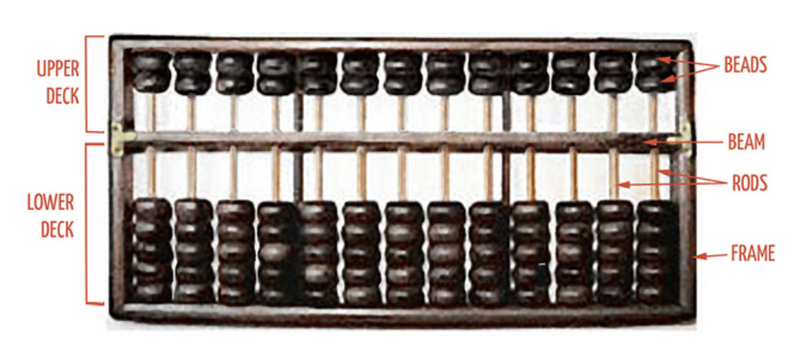
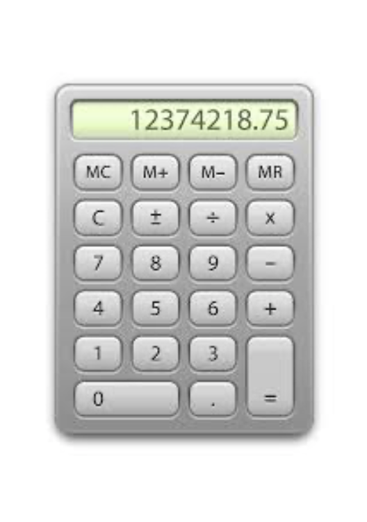
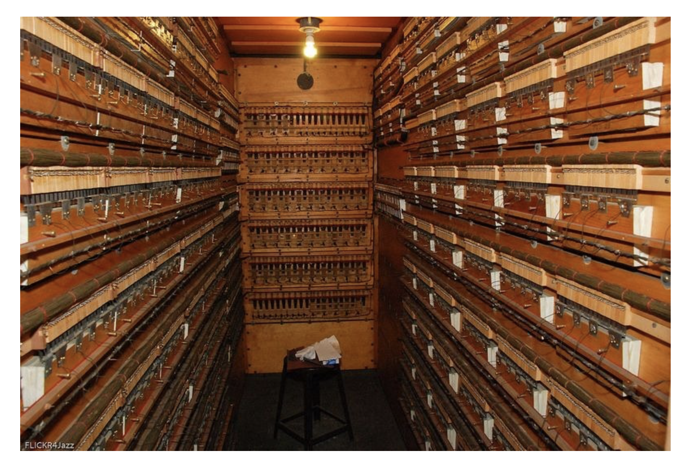
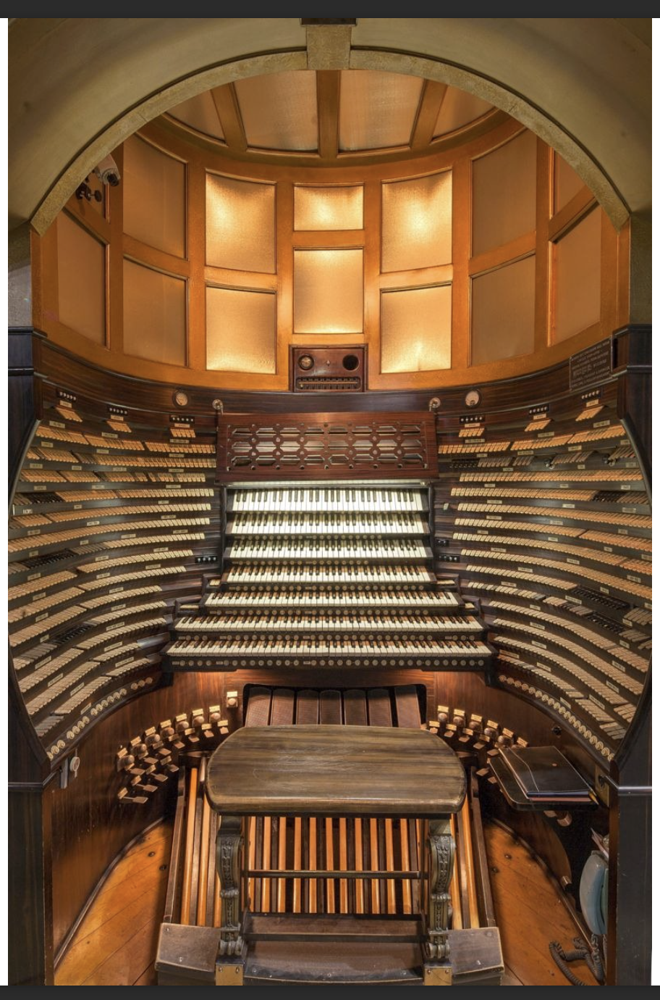
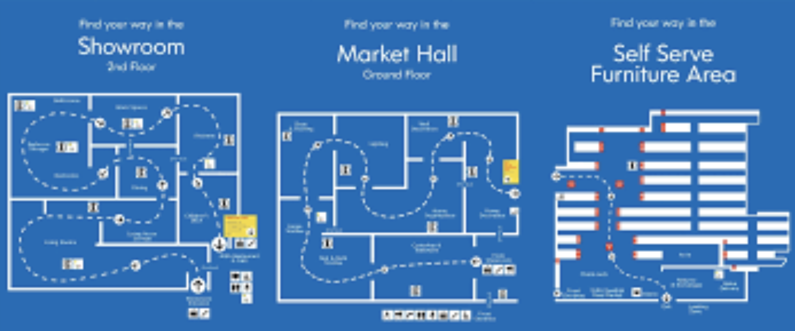
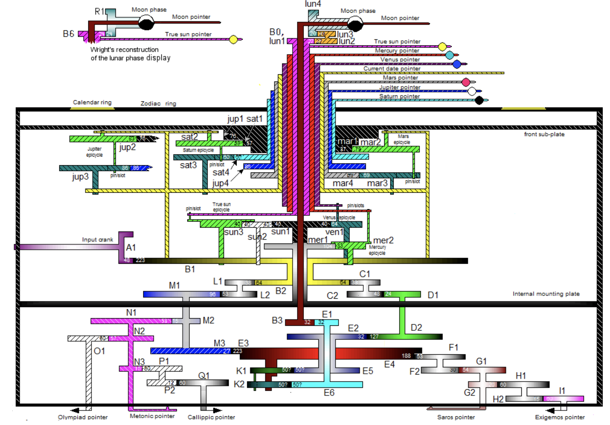

```{r setup, include=FALSE}
knitr::opts_chunk$set(echo = FALSE)

 orig <- data.frame( input = c("voice to voice recognition software"), to= c("\u2192"), 
                      algorithm = c("translation program"),
                      produces = c("\u2192"), output = c("sentence in 2nd language"))
 xbox <- data.frame( input = c("physical action to a Xbox kinnect sensor", ""), to = c("\u2192", "\u2198"), 
                      algorithm = c("Call of Duty game", "Halo game"),
                      produces = c("\u2192","\u2192"), output = c("screen reports violence", 
                          "screen reports alien violence") )
 third <- data.frame( input = c("Sanny", ""), to = c("\u2192", "\u2198"), 
                      algorithm = c("if (moon is blue)", "if (moon not blue)"),
                      produces = c("\u2192","\u2192"), output = c("Sanny beats Mike at cricket", 
                          "Sanny loses, horribly.") )

 fourth <- data.frame( input = c("Weather report", ""), to = c("\u2192", "\u2198"), 
                      algorithm = c("if (temperature <= 24)", "if (temperature > 24)"),
                      produces = c("\u2192","\u2192"), output = c("wear jacket", 
                          "do not wear jacket") )
 
 findmax <- function(L) {
   if (length(L)==0) return(-1)
   if (length(L)==1) return(L[1])
   current_largest <- L[1]
   
   for (i in 2:length(L)) {
     if (L[i] > current_largest) current_largest <- L[i]
   }
   return(current_largest)
 }
```


## Outline for today

- Part 1: Modern computing paradigms
  - What is information science?
  - What does it mean to compute? 
  - Fundamental properties of computing
  - How does this relate to biology?
- Part 2: RStudio Cloud
  - The first steps with RStudio
  - How to organize yourself in the system
  - Some examples of small R programs


## What is fundamentally a computer?

Definition: computer. (Oxford English dictionary)

- An electronic device which is capable of receiving information (data)
  in a particular form and of performing a sequence of operations
  in accordance with a predetermined but variable set of procedural
  instructions (program) to produce a result in the form of information or signal.

- Well not really. It doesn't need to be electronic.
- It doesn't necessarily need to be digital (0s and 1s)
- Then, what are then the fundamental properties defining computers and computation?

## Three broad properties of computation

 <strong> Property 1:  input $\rightarrow$ algorithm $\rightarrow$ output </strong>

```{r echo=FALSE, results = 'asis'}
library(knitr)
knitr::kable(orig, align = 'c')
```

The algorithm takes something as input, uses that input to calculate an output.

<br>
<br>

 <strong> Property 2: A notion of "reprogrammability" </strong>
 
```{r echo=FALSE, results = 'asis'}
library(knitr)
knitr::kable(xbox, align = 'c')
```

The algorithm can change. That is, different software can be used on the processor and memory. For example, you can switch which game you are playing. 

## Three broad properties of computational

 <strong> Property 3:  There is a notion of state and memory </strong>

```{r echo=FALSE, results = 'asis'}
library(knitr)
knitr::kable(third, align = 'c')
```

The algorithm makes choices depending on the input. Here, the algorithm would check the color of the moon knowing that Sanny was to bowl to me in cricket. Then, if the moon isn't blue, it would predict that he would lose, miserably.

```{r echo=FALSE, results = 'asis'}
library(knitr)
knitr::kable(fourth, align = 'c')
```

## What is an algorithm?

- Problem: Given a list of numbers called L, find the largest number.<br>
  - So the input is a list of numbers. For example, $L = ( 6, 17, 4, 39, 6, 78, 4, 2)$. <br>

- Here is an algorithm to solve this problem:

  1. If the list $L$ is empty , there is no largest number.
  2. Assume that the first element of $L$ is the largest.
  3. For each remaining number in the list
     - if it is bigger than the current largest number, make it the new largest number.
  4. When all numbers have been checked, the current largest number is the largest number in the list.
  
- So the output is one single number (the largest from $L$, $78$)

## Example of executing an algorithm

- $L = ( 6, 17, 4, 39, 6, 78, 4, 2)$

- Step 1. It's not empty so do nothing.
- Step 2. 6 is made the current largest number.
- Step 3. For all remaining numbers in $L$:
   - Is $17 > 6$? Yes, so make the current largest number $17$.
   - Is $4 > 17$? No.
   - Is $39 > 17$? Yes, so make the current largest number $39$.
   - Is $6 > 39$? No.
   - Is $78> 39$? Yes, so make the current largest number $78$.
   - Is $4 > 78$? No.
   - Is $2 > 78$? No.
- Step 4: So $78$ it is.

- Is this a computer program?
- No.
- Is it a precise recipe for solving a problem?
- Yes-ish. It depends on how precise we need to be. (Is it precise in your opinion?)

## Definition of algorithm

- An algorithm is a self-contained step-by-step set of operations to be performed.


- Computer program: A list of instructions that tell a computer what to do in order to 
	achieve some predefined task.


- Computer language: A formal constructed language for expressing computer programs.

- Computer programming: The art and science of writing programs in a specific
	programming language.

## An R program for the biggest number problem


```{r echo=FALSE, results = 'asis'}
cat("findmax <- ")
print(findmax)
```

## Is this a computing device?


<figure class="image">
<p float="center">
   
</p>
<figcaption><small> My first computer shared with my brother Pythagoras</small> </figcaption>
</figure>

input $\rightarrow$ algorithm $\rightarrow$ output? <br>
notion of reprogrammability<br>
notion of state and memory?<br>

## Is this a computing device?


<figure class="image">
<p float="center">
   
</p>
</figure>

input $\rightarrow$ algorithm $\rightarrow$ output? <br>
notion of reprogrammability<br>
notion of state and memory?<br>

## Is this a computing device?


<figure class="image">
<p float="center">
   
</p>
</figure>

input $\rightarrow$ algorithm $\rightarrow$ output? <br>
notion of reprogrammability<br>
notion of state and memory?<br>

## Ok first what is this?

<figure class="image">
<p float="center">
   
</p>
</figure>

## Answer: An organ

Before the computer, the organ was consider perhaps the most complex of human creations.

<figure class="image">
<p float="center">
   
</p>
</figure>

input $\rightarrow$ algorithm $\rightarrow$ output? <br>
notion of reprogrammability<br>
notion of state and memory?<br>


## Towards Systems Biology

<figure class="image">
<p float="center">
   
</p>
</figure>

- What properties do modern commercial enterprises have with  computing?

## The IKEA Maze: An intentional design 


<figure class="image">
<p float="center">
   
</p>
</figure>

input $\rightarrow$ algorithm $\rightarrow$ output? <br>
notion of reprogrammability<br>
notion of state and memory?<br>


 
## Action Item: The Antikythera Device

Read a little bit about this from the links [here](https://en.wikipedia.org/wiki/Antikythera_mechanism)

<figure class="image">
<p float="center">
   
</p>
</figure>

Is it  a computing device?


## Action Item: Sun Shadow Board

- Watch a little bit about this from the links [here](https://www.youtube.com/watch?v=sl-XdT_ad4c)

- Is it  computing device?

## Points of Reflection

- The concept of computation has been around for a long time.
- Three fundamental properties of computation.
- How have concepts of information and computer science drifted into the life sciences already?
- See also  [class notes](/class/) from lecture 02.


## BIOL480 

&copy; M Hallett, 2020 Concordia University


