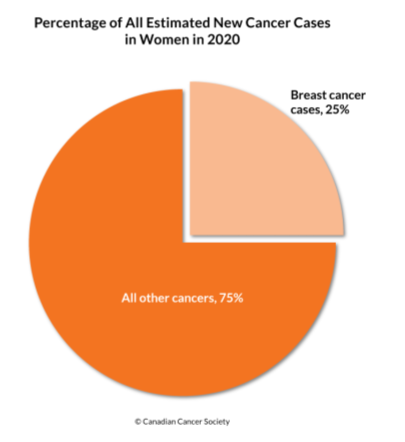
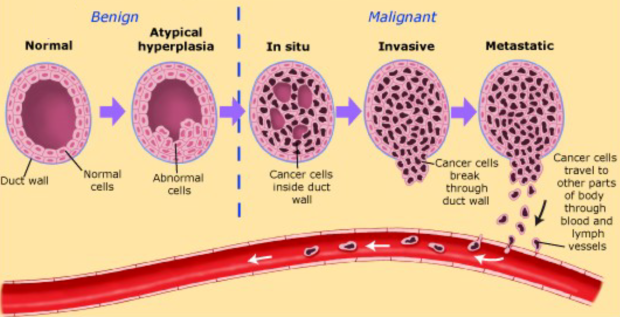
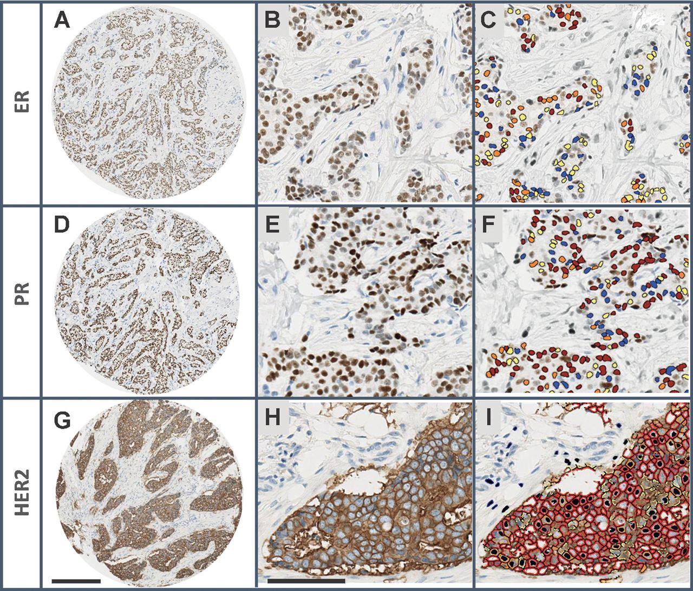
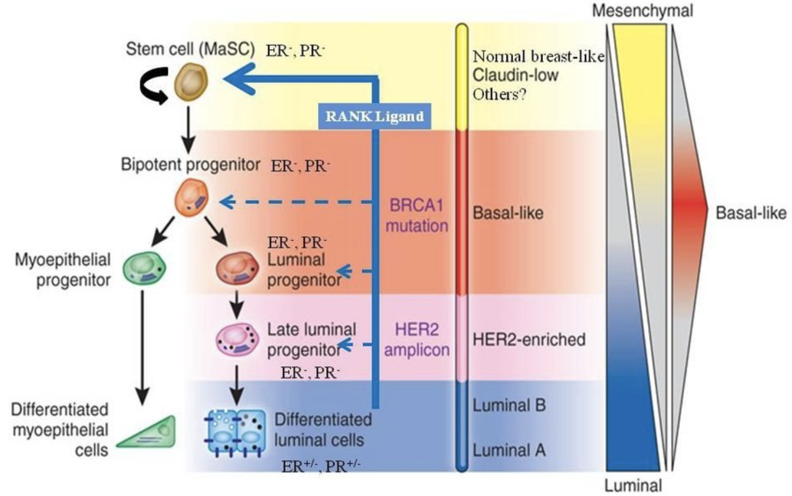
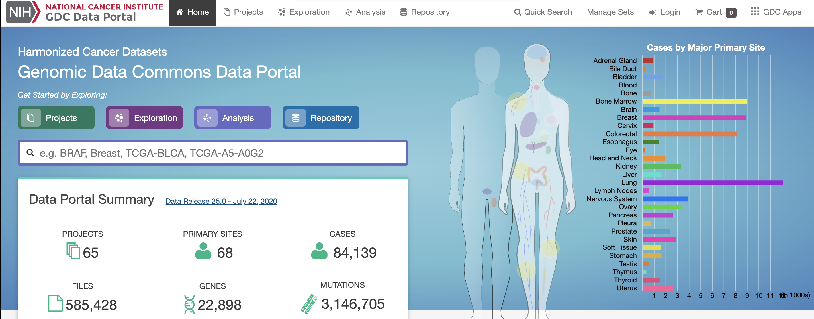
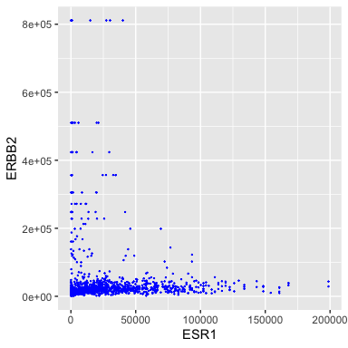
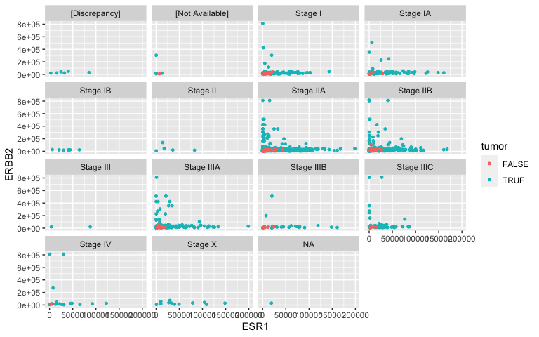
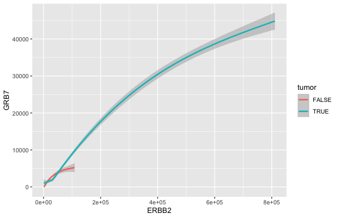
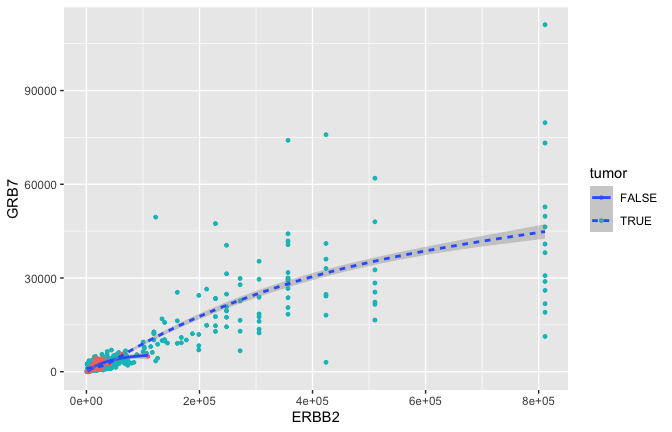
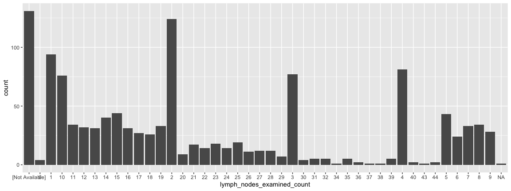

## Outline for today

- A little bit about breast cancer
   - Clinical perspective
   - Molecular perspective
- Transcriptomes
- Sequencing by Synthesis (Illumina)
- The Cancer Genome Atlas (TCGA)
- A small TCGA dataset for us to explore
- Exploration via visualization

## Clinical perspective of breast cancer (BC)

- Most commonly diagnosed cancer among Canadian women
- 25% of all cancers in women (1 in 9 women will have BC in their life time)
- 2nd leading cause of death from cancer.
- In Canada 2020,  ~27,400 new breast cancer cases 
- and 5,100 breast cancer deaths
- Men are also susceptible (not common)


<figure class="image">
<p float="center">
   
</p>
</figure>

##  Ductal breast carcinoma

Ductal in situ and invasive breast carcinoma begins in the cells of the duct.

<figure class="image">
<p float="left">
   
   
</p>
<figcaption><small>Left: From Associate Degree Nursing Physiology Review (2020). Right: From Muschler J, Streuli CH (2010) Cold Spring Harb Perspect Biol. 
</small> </figcaption>
</figure>


## Tumor progression


<figure class="image">
<p float="center">
   
</p>
<figcaption><small> [From St-John's Cancer](https://www.saintjohnscancer.org/breast/breast-cancer/types-of-breast-cancer/)
</small> </figcaption>
</figure>

##  Ductal Breast Cancer
 
- Clinical oncologists consider many types of information when deciding the therapeutic avenue for a breast cancer patient.
- Tumour, Node, Metastasis (TNM) staging systems describe the extent of the breast cancer in the patient.


<figure class="image">
<p float="center">
   
</p>
</figure>

- There are many additional ways that clinical and molecular oncologists evaluate a breast tumor.
- Examples: Tumor grade, proliferative index, estrogen receptor status, progesterone receptor status, HER2 amplification.
- This information is combined with patient attributes including age, lifestyle, BMI, genotype, history etc.

##  Immunohistochemistry (IHC) for key breast cancer proteins

Estrogen  (ER) and Progesterone  (PR) Receptors, and Human Epidermal Growth Factor (HER2)

<figure class="image">
<p float="center">
   
</p>
<figcaption><small> From Allot et al. (2016) Cancer Epidemiology, Biomarkers and Prevention. 
</small> </figcaption>
</figure>

- The expression of these three proteins has been used for $30$ years to classify breast tumors into subtypes. 

- Tumors of the three subtypes have very different clinical and molecular characteristics.

- Each subtype has different treatments. For example, Tamoxifen for ER+ tumors and Herceptin for HER2+ tumors.

-<small>In clincial settings,  HER2 status is usually measured by Flourescence In Situ Hybridization (FISH).</small>

## Subtypes of breast cancer

High-throughput profiling of the transcripts (gene expression profling or "transcriptomics") has provided a more robust detailed perspective on BC hetergeniety. 

<figure class="image">
<p float="center">
   
</p>
<figcaption><small> From Ruangpratheep 2011, Bombonati, Sgroi 2011, Lim et al. 2009, Prat, Perou 2009)
</small> </figcaption>
</figure>

- It is not just ER, PR and HER2. Many genes (and gene products) combine to determine the molecular subtype of a tumor. 

## Transcriptomics?


- [Transcriptomics](https://www.icloud.com/keynote/0n2tSKAVc2chal9Wt8cj-uDiQ#Lecture01%5FRNAseqIntro) Excellent set of slides describing sequencing technologies and trends. Includes nice graphics about Illumina technology. [From D Beiting, UPenn]

- Let's take a brief look at some of these.


## Sequencing by Synthesis (Illumina technologies)


- [Sequencing by Synthesis](https://www.youtube.com/watch?v=CZeN-IgjYCo) I would recommend starting with this one. It is quite high level. [From Henrik's World]

- [Sequencing by Synthesis II](https://www.youtube.com/watch?v=mI0Fo9kaWqo) This video is more detailed,
providing my background information on the underlying chemistry. [Eric Chow, UCSF]


<figure class="image">
<p float="center">
   
</p>
</figure>


## The Cancer Genome Atlas (TCGA)

- TCGA is a USA project across several institutes (incl The National Cancer Institute) that has profiled $> 20,000$ tumors (with matched normal) across $33$ different cancer types.

> - Each tumor/sample has a rich array of clinical, pathological and lifestyle information.
> - Each tumor/sample is profiled by different technologies including genomic (DNA sequencing), epigenomic (methylation profiles), transcriptomic (gene expression), and proteomic (protein expression) data for each tumor sample.
> - The data is publicly available and can be used by researchers to explore cancer.
> - I would recommend you read a little bit about the TCGA project [here](https://www.cancer.gov/about-nci/organization/ccg/research/structural-genomics/tcga)

<figure class="image">
<p float="center">
   
</p>
</figure>


## A minaturized TCGA BC dataset

<figure class="image">
<p float="center">
   
</p>
</figure>

<figure class="image">
<p float="center">
   
</p>
</figure>
- A lot of data of different types.  Just transcriptome and (some) clinico-pathological data for now.

- But you can go back and get more anytime you would like from the [GDC](https://portal.gdc.cancer.gov/)

## Ok, here we go.


```r
library(tidyverse)   
## ── Attaching packages ──────────────────────────────────────────────────────────────── tidyverse 1.3.0 ──
## ✓ ggplot2 3.3.2     ✓ purrr   0.3.4
## ✓ tibble  3.0.3     ✓ dplyr   1.0.1
## ✓ tidyr   1.1.1     ✓ stringr 1.4.0
## ✓ readr   1.3.1     ✓ forcats 0.5.0
## ── Conflicts ─────────────────────────────────────────────────────────────────── tidyverse_conflicts() ──
## x dplyr::filter() masks stats::filter()
## x dplyr::lag()    masks stats::lag()
# this is an R package that contains ggplot graphing tools 
#  amongst other things

load("~/data/GDC/TCGA_BRCA/small_brca.Rdata") # load the TCGA dataset for breast cancer 
```
Find ${\tt small\_brca}$ object in the environment.

## The ${\tt View()}$ function

 A tibble is a rectangular collection of variables (in the columns) and observations (in the rows).
 

```{.r .watch-out}
dim(small_brca); nrow(small_brca); ncol(small_brca)
## [1] 1215   79
## [1] 1215
## [1] 79
```

Here I've just selected $50$  well studied breast cancer genes (of $>23,000$ gene total).

```{.r .watch-out}
colnames(small_brca)
##  [1] "id"                             "tss"                           
##  [3] "participant"                    "barcode"                       
##  [5] "bcr_patient_uuid"               "form_completion_date"          
##  [7] "birth_days_to"                  "gender"                        
##  [9] "menopause_status"               "race"                          
## [11] "ethnicity"                      "tumor_status"                  
## [13] "vital_status"                   "death_days_to"                 
## [15] "histologic_diagnosis_other"     "initial_pathologic_dx_year"    
## [17] "age_at_diagnosis"               "micromet_detection_by_ihc"     
## [19] "lymph_nodes_examined_count"     "ajcc_pathologic_tumor_stage"   
## [21] "er_status_by_ihc"               "er_status_ihc_Percent_Positive"
## [23] "pr_status_by_ihc"               "pr_status_ihc_percent_positive"
## [25] "her2_fish_status"               "her2_copy_number"              
## [27] "histological_type"              "metastatic_tumor_indicator"    
## [29] "tumor"                          "ANLN"                          
## [31] "FOXC1"                          "CDH3"                          
## [33] "FGFR4"                          "UBE2T"                         
## [35] "NDC80"                          "PGR"                           
## [37] "BIRC5"                          "ORC6"                          
## [39] "ESR1"                           "PHGDH"                         
## [41] "PTTG1"                          "MELK"                          
## [43] "NAT1"                           "CXXC5"                         
## [45] "BCL2"                           "RRM2"                          
## [47] "GPR160"                         "EXO1"                          
## [49] "UBE2C"                          "TYMS"                          
## [51] "KRT5"                           "KRT14"                         
## [53] "MAPT"                           "CDC6"                          
## [55] "MMP11"                          "MYBL2"                         
## [57] "SFRP1"                          "CCNE1"                         
## [59] "BLVRA"                          "BAG1"                          
## [61] "MLPH"                           "CDC20"                         
## [63] "CENPF"                          "MIA"                           
## [65] "KRT17"                          "FOXA1"                         
## [67] "ACTR3B"                         "CCNB1"                         
## [69] "MDM2"                           "MYC"                           
## [71] "CEP55"                          "SLC39A6"                       
## [73] "ERBB2"                          "GRB7"                          
## [75] "KIF2C"                          "NUF2"                          
## [77] "EGFR"                           "MKI67"                         
## [79] "TMEM45B"
```

## First 3 samples (of 1215)

```{.r .watch-out}
print(small_brca[1:3, 1:4])
## # A tibble: 3 x 4
##   id                           tss   participant barcode     
##   <chr>                        <chr> <chr>       <chr>       
## 1 TCGA-E9-A1NF-01A-11R-A14D-07 E9    A1NF        TCGA-E9-A1NF
## 2 TCGA-D8-A27M-01A-11R-A16F-07 D8    A27M        TCGA-D8-A27M
## 3 TCGA-BH-A0GZ-01A-11R-A056-07 BH    A0GZ        TCGA-BH-A0GZ
```

```{.r .watch-out}
print(small_brca[1:3, 5:8])
## # A tibble: 3 x 4
##   bcr_patient_uuid                     form_completion_date birth_days_to gender
##   <chr>                                <chr>                <chr>         <chr> 
## 1 a8b1f6e7-2bcf-460d-b1c6-1792a9801119 2011-6-23            -21981        FEMALE
## 2 ae65baeb-6b78-492a-8c63-bb7e93e83dc2 2011-7-17            -21910        FEMALE
## 3 27dfb9d4-3a2c-44bc-9acf-8f638d3f3004 2010-11-10           -22714        FEMALE
```

```{.r .watch-out}
print(small_brca[1:3, 9:13])
## # A tibble: 3 x 5
##   menopause_status race  ethnicity              tumor_status vital_status
##   <chr>            <chr> <chr>                  <chr>        <chr>       
## 1 Post             WHITE NOT HISPANIC OR LATINO TUMOR FREE   Alive       
## 2 Post             WHITE NOT HISPANIC OR LATINO TUMOR FREE   Alive       
## 3 Post             WHITE [Not Available]        TUMOR FREE   Alive
```

## Scatterplot


```r
ggplot(data = small_brca) + 
  geom_point(mapping = aes(x = ESR1, y = ERBB2))
```


- ERBB2 is the official gene name for HER2.
- The ${\tt ggplot()}$ function is where it all begins. Here we specify the tibble that stores the data we are going to us.
- We add layers to the plot using the + operator. A ${\tt geom}$ species the type of geometric object. - Here we specify points for a scatterplot.

## Scatterplot

Ok, I don't like the black and the points are too big.

```r
ggplot(data = small_brca) + 
  geom_point(mapping = aes(x = ESR1, y = ERBB2), color = "blue",  size = 0.1)
```



- ${\tt size}$ is in mm. 
- Want some colors? Go [here](http://sape.inf.usi.ch/quick-reference/ggplot2/colour) or use Hex
[here](https://www.google.com/search?rlz=1C5CHFA_enCA892CA893&sxsrf=ALeKk03E_3TwFW5hGqlW1oarFO2ZBcWfPA%3A1597095361721&ei=wb0xX8XAK6SV_QbtiaCQCg&q=%23ffffff&oq=%23ffffff&gs_lcp=CgZwc3ktYWIQAzoECCMQJ1CEPViEPWCBQGgBcAB4AIAB9gKIAdoIkgEDMy0zmAEAoAEBqgEHZ3dzLXdpesABAQ&sclient=psy-ab&ved=0ahUKEwiFpdTty5HrAhWkSt8KHe0ECKIQ4dUDCAw&uact=5)

## Aesthetic mappings


```r
ggplot(data = small_brca) + 
  geom_point(mapping = aes(x = ESR1, y = ERBB2, color = tumor), size = 0.1)
```


- Some of our samples are tumors and some are _matched normal_. Perhaps not surprisingly, the normals have low expression of both oncogenes.

- Note that the aesthetic (${\tt aes}$) contains a third argument ${\tt color}$ that uses the 
${\tt tumor}$ attribute/column. Careful, note that the color is __inside__ the ${\tt aes}$!


## Aesthetic mappings: Race 


```r
ggplot(data = small_brca) + 
  geom_point(mapping = aes(x = ESR1,  y = ERBB2, 
                           color = race), size = 1)
```


## Aesthetic mappings: TNM staging


```r
ggplot(data = small_brca) + 
  geom_point(mapping = aes(x = ESR1,  y = ERBB2, 
                          shape = tumor, color = ajcc_pathologic_tumor_stage), size = 1)
```


- A bit noisey

## Facets: TNM staging revisited

- Facets partition the data (ESR1 vs HER2 expression) according to a third attribute (tumor stage). Notice the tilde ($\sim$). This species a _formula_ (more about this later).


```r
ggplot(data = small_brca) + 
  geom_point(mapping = aes(x = ESR1,  y = ERBB2, color = tumor), size = 1) +
  facet_wrap( ~ ajcc_pathologic_tumor_stage, nrow = 4)
```




## Facets: Histological Type

- I'm not too convinced in a relationship between ER, HER2 and TNM staging. What about histological type?


```r
ggplot(data = small_brca) + 
  geom_point(mapping = aes(x = ESR1,  y = ERBB2, color = tumor), size = 1) +
  facet_wrap( ~ histological_type, nrow = 4)
```


## Geometric objects

- GRB7 and ERBB2 (aka HER2) show correlation in their expression. This makes sense because high expression of HER2 in BC is very often due to amplification of the chromosomal region that contains HER2. In some patients, this genomic locus is amplified (duplicated) 30-50x. GRB7 lies very close to HER2 in this so-called _amplicon_.


```r
ggplot(data = small_brca) + 
  geom_point(mapping = aes(x = ERBB2,  y = GRB7, color = tumor), size = 1) 
```


## Smoothing

- Often we would just like to capture the essence of the relationship. Here for example that could be represented by a curve and a confidence interval ${\tt geom\_smooth}$ rather than the actual points ${\tt geom\_point}$.


```r
ggplot(data = small_brca) + 
  geom_smooth(mapping = aes(x = ERBB2,  y = GRB7, color = tumor), size = 1) 
## `geom_smooth()` using method = 'gam' and formula 'y ~ s(x, bs = "cs")'
```




## Smoothing


```r
ggplot(data = small_brca) + 
  geom_smooth(mapping = aes(x = ERBB2,  y = GRB7, linetype = tumor), size = 1) 
## `geom_smooth()` using method = 'gam' and formula 'y ~ s(x, bs = "cs")'
```


## Smoothing


```r
ggplot(data = small_brca) + 
  geom_point(mapping = aes(x = ERBB2,  y = GRB7, color = tumor), size = 1) +
  geom_smooth(mapping = aes(x = ERBB2,  y = GRB7, linetype = tumor), size = 1) 
## `geom_smooth()` using method = 'gam' and formula 'y ~ s(x, bs = "cs")'
```



## Statistical transformations

- Lymph node status has long been used by clinicians to measure how far a tumor has progressed. They count the number of positive lymph nodes and pay particular attention to the so-called _sentinal_ lymph node (the one closest to the tumor). 


```r
ggplot(data = small_brca) + 
  geom_bar(mapping = aes(x=lymph_nodes_examined_count))
```



- It is possible to reorder the x-axis but not for today....

## Statistical transformations are beautiful


```r
ggplot(data = small_brca) + 
  geom_bar(mapping = aes(x=lymph_nodes_examined_count, fill = ajcc_pathologic_tumor_stage))
```


- Notice how low stages "disappear" in patients with many lymph nodes.

## ggplot2: a grammar for graphs

- Perhaps you can begin to see the power of programming. 
- ggplot2, like many R packages, offer a type of grammar where you build whatever you imagine
- This is how I operate:
  - [R Graph Catalog](https://www.r-graph-gallery.com/): R code for 124 ggplot graphs..
   - See all [Our Resource Page](/resources)

## Points of Reflection

- What limitations would transcriptome based studies face?
- What privacy issues might arise in -omic studies? Specifically, consider a transcriptome based study versus a genomic DNA-based study.
- Most, if not all, Human tissue is comprised of many different cell types. For example, a breast tumor will include epithelial cells, fibroblasts, immune cells of different kinds, adipocytes, and cells associated with the vasculature and lymphatics system. What kinds of affects could this happen on transcriptiona profiles like those found in TCGA?
- Challenge: Find where ERBB2 and GRB7 lie on the human genome? What database would you used? What other genes are in that region?
- What do lymph nodes do? Why might they be an important indicator in BC progression?


## BIOL480 

&copy; M Hallett, 2020 Concordia University


