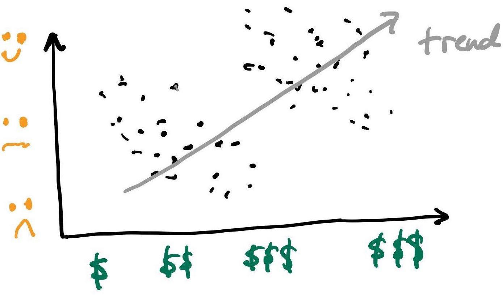

```{r setup, include=FALSE}
knitr::opts_chunk$set(echo = FALSE)
library(tidyverse)
```


## Simpson's Paradox 


- Simpson's paradox: The phenomenon where  a trend appears in several different groups of data but disappears or reverses when these groups are combined. 

<figure class="image">
<p float="center">
   
   
</p>
</figure>

- Suppose here we asked a group of people  how much they paid for their car and how satified they are with it.
- When we are not aware that the  points (samples, people, objects) belong to two
distinct groups (eg poor vs rich, tumor vs normal, patients vs healthy etc) the data suggests
an upward trend. 
- However if we were told that the blue points are low income people and red are high income, our interpretation might change.
- How would interpret these plots?
- Your challenge is to figure out how this relates to today's lecture.

## Outline for today

- Today we investigate the __Transform__ in the the Transform $\rightarrow$ Visualize $\rightarrow$ Model cycle.
   
<figure class="image">
<p float="center">
   
</p>
<figcaption><small> From R for Datas Sience, Chapter 6.
</small> </figcaption>
</figure>

- We will return to our ${\tt tcga\_brca}$ breast cancer transcriptomics dataset.

- Transformations select specific subsets of the data for visualization and modelling.

## What are we fighting for?

- First let's ask why do we want to do data science on BC transcriptomes, or any other dataset  for that matter? What are our goals? What motivates the study?

[Old Protest Song](https://www.youtube.com/watch?v=DiWcDt8566g)

- Ok, it's certainly not warfare but the analysis of datasets can quickly result in a quagmire that takes months or years to complete.

- It's important to go into the analysis with a set of questions that are as clear and well-defined as posible. Not perhaps as precise as clinical trials, but awareness of the design, power and goals of the experiment really help avoid long protracted struggles with the data and false findings.

## Common goals in cancer informatics

- Basic science, for sure. 

- Better underestanding of the molecular basis of BC. Eg which genes, pathways and processes are at play in each subtype of the disease. This might lead to new therapies or therapeutic avenues.

- Discover ways to intervene clinically. What is the clinical end-point of the study?

- Clinical endpoints are  distinct measurements or analyses of disease characteristics observed in a research study or a clinical trial that reflect the effect of a therapeutic intervention.

## Examples of research projects for different clinical endpoints

- __Disease Marker__ Find a gene(s) that indicates a woman (in the population) is at risk of developing breast cancer.

- __Screening__ Build image analysis technology to identify with high accuracy very small tumors in the mammary gland.

- __Diagnosis__ Find a gene(s) or gene products that accurately confirm that a woman does or does not have breast cancer (eg analogous to a pregnancy test).

- __Classification__ Given that a woman has been diagnosed with BC, find a gene(s) or gene products that classify her tumor into the correct subtype.

- __Prognosis__ Given that a woman has been diagnosed with a specific type of BC, predict how long she will live disease-free post-initial treatment/surgery.

- __Benefit from  Therapy__ Given the characteristics of a woman's tumor, predict whether she will or will not benefit from a specific therapy.

- __Monitoring__ Find a gene(s) or gene products that faithfully report if a new tumor (micrometastasis) has appeared in a woman post-treatment.

##  Clinical Validity and Utility

- Whatever the endpoint is, ideally the endpoint has these two properties.

- __Clinical utility__ means that the result of your research can be used by clinicians to change their decision making in precise ways.

- __Clinicial validity__ means that the result of your research generalizes to the intended population, and remains able to function with sufficient efficacy.

## Bottomline here

- Bio-data is inherently very noisey. 

- Technical noise due to inaccurate measurements and bias in the measurements.

- Biological noise due to  natural variability between patients (eg small genetic differences),
cells (eg cell cycle fluctuations) and diferences due to lifestyle etc.

- When starting out your analysis, it is wise to search for a core _homogenous_ subgroup. It might be easier to solve the problem (eg find the gene or gene products for your endpoint) in this core group first, and then expand your analysis out to the larger cohort.

- I will give some examples of _transformations_ now.

## Initialize our session

- We are going to focus on a package called ${\tt dplyr}$ today. It's also part of the ${\tt tidyverse}$. 

- If ${\tt ggplot2}$ is the grammar of plots, ${\tt dplyr}$ is the grammer of data transformation.

```{r echo=TRUE, fig.align='left', collapse=TRUE, class.source="watch-out"}
library(tidyverse)
load("~/data/GDC/TCGA_BRCA/small_brca.Rdata")   # load the BC dataset
#View(small_brca)                # handy to have that open for exploration
```

## Note the class of the different attributes

- There are three classes here: ${\tt character (chr)}$, ${\tt lgl (logical)}$ and ${\tt dbl (double)}$. Note that ${\tt double}$ is the same as ${\tt numeric}$. Historical anomaly. 

```{r echo=TRUE, fig.align='left', collapse=TRUE, class.source="watch-out"}
small_brca               
```

- There are other classes not used here. We will see ${\tt fctr (factors)}$ later.

## ${\tt dplyr}$ cheat sheet (part 1)

- __variables__ are columns; __observations__ are rows.

<figure class="image">
<p float="center">
   
</p>
</figure>


## ${\tt dplyr}$ cheat sheet (part 2)

- Available [here](https://github.com/rstudio/cheatsheets/blob/master/data-transformation.pdf)
- Mounted R cheat sheets make great  gifts for Bioinformaticians!

<figure class="image">
<p float="center">
   
</p>
</figure>

## Filtering observations

- Remember:  __variables__ are columns; __observations__ are rows.
 Sometimes you want to analyze just a subset of all your observations (rows; samples). Before  visualization, you need to remove unwanted rows. And that's why the ${\tt filter()}$ functions exist.

- For example, let's remove the morphologically normal samples from the analysis.

```{r echo=FALSE, fig.align='center', collapse=TRUE, fig.width = 4, fig.height=4, incremental=FALSE }
ggplot(data = small_brca) + 
  geom_point(mapping = aes(x = ESR1, y = ERBB2, color = tumor), size = 0.1)
```

## Filtering out normal samples

```{r echo=TRUE, fig.align='left', collapse=TRUE, class.source="watch-out"}
(tumor_brca <- filter(small_brca, tumor==TRUE))               
```


## Let's make sure that worked

```{r echo=FALSE, fig.align='center', collapse=TRUE, fig.width = 4, fig.height=4, incremental=FALSE }
ggplot(data = tumor_brca) + 
  geom_point(mapping = aes(x = ESR1, y = ERBB2, color = tumor), size = 0.1)
```

## Filtering out samples with unknown or ill-defined TNM stage

- Recall from Lecture 02 our disucssion of TNM staging.

```{r echo=TRUE, fig.align='left', collapse=TRUE, class.source="watch-out"}
unique(tumor_brca$ajcc_pathologic_tumor_stage)
```

- ${\tt unique()}$  returns the distinct (or unique) objects observed in a (long) vector of objects. Try removing the ${\tt unique()}$ call from above and see what happens.

- There are four (of 15) types of objects that I would like to remove from the analysis to begin with: 9, 12, 13, 14. 

- Note the NA for #14. Not that same as the character "[Not Available]" #12 (but both must go!).

## Filtering by TNM stage

```{r echo=TRUE, fig.align='left', collapse=TRUE, class.source="watch-out"}
(tnm_tumor_brca <- filter(tumor_brca, !( (is.na(ajcc_pathologic_tumor_stage) |
                                         (ajcc_pathologic_tumor_stage == "[Discrepancy]") |
                                         (ajcc_pathologic_tumor_stage == "[Not Available]") |
                                         (ajcc_pathologic_tumor_stage == "Stage X") ) )   ) )
```

- Note the logical expression using the ${\tt !~(not)}$ operator and the ${\tt |~(or)}$ operator.
- This also works (try to understand why  ${\tt ? ~ grepl()}$ ):

<code> filter(tumor_brca, grepl("Stage", ajcc_pathologic_tumor_stage)) </code>

## Arranging the observations

- Sometimes we don't want to filter out observations but simply arrange them in a more informative manner.

- Our goal here is to sort first by TNM stage, and then according to how many days they survived since diagnosis.

```{r echo=TRUE, fig.align='left', collapse=TRUE, class.source="watch-out"}
sorted_tnm_tumor_brca <- arrange(tnm_tumor_brca, ajcc_pathologic_tumor_stage, death_days_to)
head(sorted_tnm_tumor_brca)
```

## Arranging the observations by TNM and survival time


```{r echo=TRUE, fig.align='left', collapse=TRUE, class.source="watch-out"}
tail(sorted_tnm_tumor_brca)
```

- What happened here?

- Hint: What is the type of ${\tt deaths\_days\_to}$?

- How do we fix this?

## Converting the type of a variable (column)

- Currently, ${\tt death\_days\_to}$ has type  ${\tt character}$.

- lexicographical ordering: "a" < "ab" < "b"

- "1" < "12" < "2"

- 1 < 2 < 12


```{r echo=TRUE, fig.align='left', collapse=TRUE, class.source="watch-out"}
tail(sorted_tnm_tumor_brca[, c( "ajcc_pathologic_tumor_stage", "vital_status", "death_days_to")])
sorted_tnm_tumor_brca$death_days_to <- as.numeric( sorted_tnm_tumor_brca$death_days_to )
```

## Converting the type of a variable (column)

```{r echo=TRUE, fig.align='left', collapse=TRUE, class.source="watch-out"}
tail(sorted_tnm_tumor_brca[, c( "ajcc_pathologic_tumor_stage", "vital_status", "death_days_to")])
```

- Note that the ${\tt chr}$ is now a ${\tt double~(dbl)}$ (a real number).

- Note also that we haven't re-sorted yet... That's next...

## Converting the type of a variable (column)


```{r echo=TRUE, fig.align='left', collapse=TRUE, class.source="watch-out"}
final_brca <- arrange(sorted_tnm_tumor_brca, ajcc_pathologic_tumor_stage, death_days_to)
final_brca[1058:1068, c( "ajcc_pathologic_tumor_stage",  "death_days_to")]
```

## ???

- But TNM stage (variable ${\tt ajcc\_pathologic\_tumor\_stage}$) is also a ${\tt character}$; why did it  sort correctly? 

```{r echo=TRUE, fig.align='left', collapse=TRUE, class.source="watch-out"}
final_brca$ajcc_pathologic_tumor_stage
```

## Selecting variables (columns)

- Sometimes after you have downloaded data and _wrangled_ it into a ${\tt tibble}$, there are
some variables (columns) that you are perhaps not interested in.

- The ${\tt select()}$ function is designed to easily pick out variables you want from those you don't.


```{r echo=TRUE, fig.align='left', collapse=TRUE, class.source="watch-out"}
final_brca
```


## Selecting variables (columns)

```{r echo=TRUE, fig.align='left', collapse=TRUE, class.source="watch-out"}
(mini_brca <- select(final_brca, participant, birth_days_to, menopause_status, race, ethnicity))
```

- But suppose we wanted to retain many columns (not just a few). Wearisome to type all of the columns into the ${\tt select()}$ call.


## Selecting many variables with the  colon operator

```{r echo=TRUE, fig.align='left', collapse=TRUE, class.source="watch-out"}
(mini_brca <- select(final_brca, participant, ANLN:TMEM45B ))
```

- ${\tt x:y}$ selects all  variables between $x$ and $y$ inclusive.


## Removing variables with the minus operator

```{r echo=TRUE, fig.align='left', collapse=TRUE, class.source="watch-out"}
(mini_brca <- select(final_brca,  -c(id, tss, barcode:birth_days_to) ))
```

- ${\tt -}$ removes all  variables between $x$ and $y$ inclusive.


## Re-ordering variables 
- Sometimes you don't want to remove variables but just highlight certain variables you look at more often. 

```{r echo=TRUE, fig.align='left', collapse=TRUE, class.source="watch-out"}
(hilite_brca <- select(final_brca, participant, ajcc_pathologic_tumor_stage, vital_status, death_days_to, everything() ))
```

## Renaming variables 
```{r echo=TRUE, fig.align='left', collapse=TRUE, class.source="watch-out"}
(simple_brca <- rename(hilite_brca,  stage = ajcc_pathologic_tumor_stage ))
```


## Grouping by variables and summarizing

- Suppose we ask the question: For each stage of the disease, what is the mean number of days patients survived before passing away? 

```{r echo=TRUE, fig.align='left', collapse=TRUE, class.source="watch-out"}
reordered_brca <- group_by(simple_brca,  stage, vital_status )
print(reordered_brca[8:30, 1:4])
```


## Grouping by variables and summarizing

- Suppose we ask the question: For each stage of the disease, what is the mean number of days patients survived before passing away? 

```{r echo=TRUE, fig.align='left', collapse=TRUE, class.source="watch-out"}
(answer <- summarize(reordered_brca, mean_survive = mean(death_days_to),
                          st_dev = sd(death_days_to),
                          n = n()  # this counts the number in each group
                     ))
```


- hhhmmm is that what you expected? Does the standard deviation (${\tt st\_dev}$) and count ($n$) influence your intepretation?

## Adding new variable to your ${\tt tibble}$

It is often useful to add new columns that are functions of existing columns. 

```{r echo=TRUE, fig.align='left', collapse=TRUE, class.source="watch-out"}
augmented_brca <- mutate(reordered_brca, death_yrs = death_days_to / 365)
augmented_brca <- select(augmented_brca, participant, death_days_to, death_yrs, everything() )
print(augmented_brca, n=15)
```

## Complete the  Transform $\rightarrow$ Visualize $\rightarrow$ Model cycle

- Let's visualize the survival times stratified by TNM Stage.
- For clarity, let's start from the top with ${\tt small\_brca}$.

```{r echo=TRUE, fig.align='left', collapse=TRUE, class.source="watch-out"}
b0 <- rename(small_brca,  stage = ajcc_pathologic_tumor_stage )
b1 <- filter(b0, (grepl("Stage", stage) & !grepl("Stage X", stage) & tumor==TRUE)) 
b2 <- select(b1, participant, stage, vital_status, death_days_to)
b3 <- filter(b2, vital_status=="Dead")
b4 <- mutate(b3, death_yrs = as.numeric(death_days_to) / 365)
g <- ggplot(data=b4)  +
    geom_point(  aes(x = reorder(participant, death_yrs), y= death_yrs, color=stage), size=1)+
    ggtitle("Survival Times by Stage") +
    xlab("Patient") + ylab("Time to Death (Yrs)") +
    theme(plot.title = element_text(lineheight=.8, face="bold", size = 20)) +
    theme(text = element_text(size=11)) + 
    coord_flip() +
     facet_wrap(~ stage, nrow = 1)
```

- This looks pretty hardcore. We are making progress.

## The output

```{r echo=TRUE, fig.align='left', collapse=TRUE, class.source="watch-out"}
g
```

## The output

```{r echo=TRUE, fig.align='left', collapse=TRUE, class.source="watch-out"}

b5 <- group_by(b4, stage)
(b6 <- summarise(b5, n=n(), 
                    mean_death_yrs = mean(death_yrs)))

```
## The output

```{r echo=TRUE, fig.align='left', collapse=TRUE, class.source="watch-out"}
g + geom_hline(yintercept=b6$mean_death_yrs[1], color = "red") +
  geom_hline(yintercept=b6$mean_death_yrs[9], color = "blue")

```

## Challenge

- The last $50$ variables give expression values for $50$ genes. When I was _wrangling_ this data into a ${\tt tibble}$, I just used the gene name.

- Arguably, it would have been better to us variables names of the form ${\tt Gene.ANIN, Gene.FOXC1, Gene.CDH3,}$ etc.

- Why? Because this clearly marks these variables as different than the first $29$ variables which are not gene expression.

- If I wanted to add or delete these variables with ${\tt select()}$, I could have used something like the ${\tt starts\_with()}$ function.

- Create a ${\tt tibble}$ called ${\tt pure\_expression}$ that contains only the ${\tt participant}$ variables, and the expression of all $50$ genes, after changing the gene names as discussed above.

## Points of Reflection

- What advantages or disadvantages are there between traditional spreadsheets and these types of transformations in ${\tt R}$?


- How does the  Transform $\rightarrow$ Visualize $\rightarrow$ Model cycle relate to Simpson's paradox?

- In the slids above, we focused on removing observations (rows) to reduce the heterogeneity in our dataset. It might be easier to see interesting patterns when technical and nuisance biological variability is reduced. What are the potential downsides of reducing the number of observations?

- Although data scientists speak about the  Transform $\rightarrow$ Visualize $\rightarrow$ Model cycle,
what similarities and differences do you see between this cycle and what you experience as a bench
scientist?


## BIOL480 

&copy; M Hallett, 2020 Concordia University


