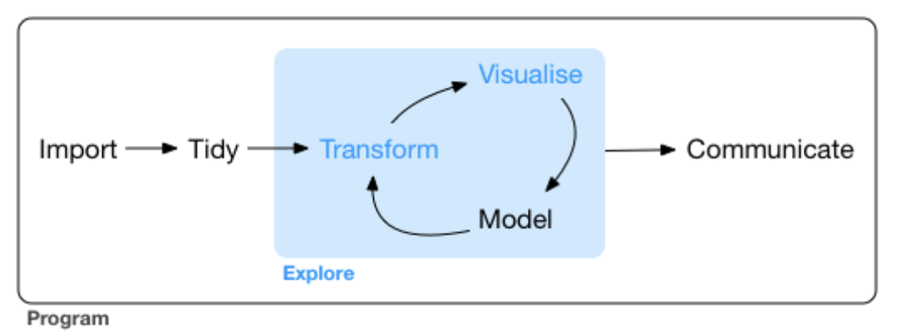

```{r setup, include=FALSE}
knitr::opts_chunk$set(echo = FALSE)
```

## Plan for Today

- Check out Les Stroud's Youtube channel for classic [Survivorman](https://www.youtube.com/watch?v=yNxro4Nn_Ok).

- Today I will be stranded on a desert island in the fierce conditions of the south pacific ocean.

- With nothing but my Arc'teryx jacket and a single RSTudio Cloud license;

- I will seek to survive the incredible sunny days, really salty water, and relentless sand 

- ... suriving on nothing more than microbes that I wrangled into my ${\tt tibble}$.

- It might seem easy but a week without that special tea from Indonesia of questionable legality  which my grad student keeps giving me, and you are dead.

## Our attempt to harvest Tara Oceans data 

- ... and wrangle it into our RStudio session.

- [Tara Oceans](https://oceans.taraexpeditions.org/en/)  

- [Sunagawa et al. (2015) Structure and function of the global ocean microbiome. Science](https://science.sciencemag.org/content/348/6237/1261359.long)

- We will start our survival expedition here [Sunagawa et al. (2015) Supplemental Data](http://ocean-microbiome.embl.de/companion.html)


## Map of where we are


<figure class="image">
<p float="center">
   
</p>
<figcaption><small> From R for Datas Sience, Chapter 6.
</small> </figcaption>
</figure>


## Survivorman's  goals

- A bit about metagenomics

- 3 zones of assessment for wrangling wild data

- We will also learn a little bit of Unix.

- Get (a bit of) the data from Tara Oceans into a tibble.

## What is metagenomics?

- [Intro. to Metagenomics](https://www.youtube.com/watch?v=gWzUWa7-UWA): more focus on human microbiomes whereas we are looking at marine microbiomes.


- Other links to material for metagenomics computational biology. This sort of  analysis comes later.

- Today we are just focused on wrangling a metagenomics dataset into R.


## What is metagenomics?

- Sampling the _microbiome_ of a site.
  - human: gut, mouth, etc.
  - soil 
  - water: ocean, lakes, ...
  
- What is a microbiome?
  - The collection of endogenous viruses, Bacteria, Archae, and single-celled Eukaryota living in a space or environment.
  - They can be living in commensal, pathogenic or symbiotic relationsips with each other and their environment (host).
  
- What are the fundamental questions?
  - What taxa are present?
  - What is the frequency of each taxa?
  - What is the state of each organism (eg measured through transcriptomics)?
  - What does each taxa contribute to the community or environment?
    - For example, a sample may have a lot of cyanobacteria because...
    - For example, a sample may have a lot of Vibrio spp because ...
    - For example, a smaple may have a lot of protists because ...
  
## Tara Oceans Project

- Sample is essentially an Eppendorf of sea water with many metaparameters describing the envrionment.
  - lattitude and longitutde, date, time
  - from soil bed, 1 meter above, near sea surface etc.
  - depth of sample, temperature of water
  - salinity, nitrogen, phosphate and other chemical parameters of water
  - method used, person who collected it, processing time, kit numbers etc

- All genomic DNA (gDNA) is extracted from the sample

- ... and prepared for sequencing (see slides and video now)

## BIOL 480 on location


&copy; M Hallett, 2020 Concordia University


