```{r setup, include=FALSE}
knitr::opts_chunk$set(echo = FALSE)
library(tidyverse)
```

## Genomes

- Not surprisingly, genomes are commonly required for analysis (otherwise, why would we be doing all this sequencing?)

- Some are small (viruses) and some are big (plants). [R Shiny app](https://saladi.shinyapps.io/Genome_size_vs_protein_count/)

- Some are circular including virsuses, prokaryotes (that is, Bacteria and Archae/without nucleus) and mitochondria of Eukaryota.

- Some are linear (Eukaryota but some bacteria  have linear genomes). 

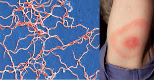

## Cancer genomes

- A hallmark of cancer is genomic instability. 

- The neoplasticity of cancer genomes results in novel point mutations, chromosomal amplifications, loss, loss of heterozygosity, aneuploidies, euploidies etc.

<figure class="image">
<p float="center">
  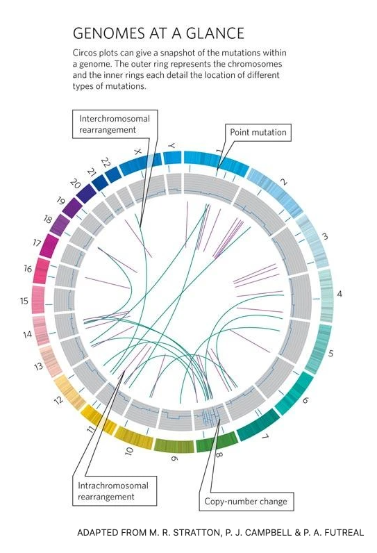 
</p>
<figcaption><small>Circos plot comparing cancer versus normal genome 
</small> </figcaption>
</figure>


## Genomes

- How many genomes have been sequenced to date? It depends a bit on how you count.

- [Genomes at the NCBI](https://www.ncbi.nlm.nih.gov/genome/browse/#!/overview/)

- Some organisms have multiple assemblies. 

- Some organisms have been sequenced many many times (at least partially) [23andme](https://www.23andme.com/en-ca/)


## Genomes

- Some have multiple strains. 
- [Nextstrain](https://nextstrain.org/)
- [UCSC Genome Browser for SARS-CoV-2](https://genome.ucsc.edu/cgi-bin/hgTracks?db=wuhCor1&lastVirtModeType=default&lastVirtModeExtraState=&virtModeType=default&virtMode=0&nonVirtPosition=&position=NC_045512v2%3A1%2D29903&hgsid=918274855_AzGyruacrcnN3hPj2V9DUvhPYMoY) 


<figure class="image">
<p float="center">
  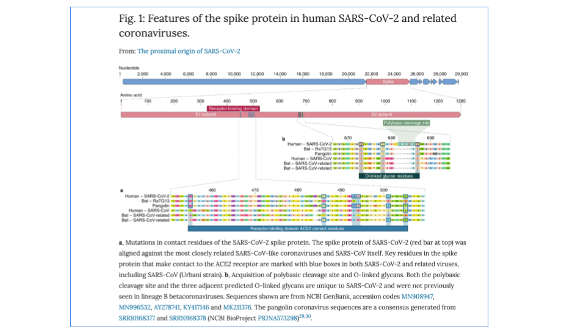 
</p>
</figure>

<figure class="image">
<p float="center">
    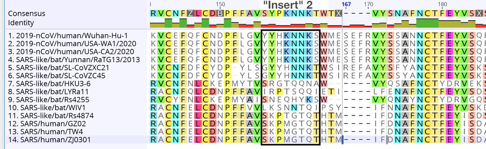 
</p>
</figure>


## Software to visualize genomes

- [NCBI Genomes and Maps Tools](https://www.ncbi.nlm.nih.gov/guide/genomes-maps/)


- [UCSC Genome Browser](https://genome.ucsc.edu/cgi-bin/hgGateway?hgsid=918274855_AzGyruacrcnN3hPj2V9DUvhPYMoY) but not all orgnaisms are there.

- [Ensembl](https://uswest.ensembl.org/index.html) European effort. Started with Human, then vertebrates and now more species. 

- [Integrative Genomics Viewer (IGV)](http://software.broadinstitute.org/software/igv/) Particularly good for visualizing DNA and RNA-seq data.

(Except for IGV, all of these efforts also act as a  repository for genomes. NCBI is most complete but UCSC and Ensembl have most model organisms.)

## What are the issues here? 

- What if you want to ask the question of the form: What binding sites are in the promoter of gene X? Where are the enhancers for gene Y? How do transcription start sites change across the genome? Where are all the cut sites for a restriction enzyme? For a region R on chromosome C of organism X, what is its syntenic regions across all fungi? 

- For these kinds of questions, visualization tools won't suffice.

- For that we need the data represented in good data structures and the capcity to manipulate it


## Where we are and what is required

<figure class="image">
<p float="center">
   
</p>
<figcaption><small> From R for Datas Sience, Chapter 6.
</small> </figcaption>
</figure>

- Where to get the genomes __and__ annotations from?
- How to represent them in R? (not tidy data but other packages)


## Different ways to download: NCBI

- [NCBI Genome](https://www.ncbi.nlm.nih.gov/genome)

<figure class="image">
<p float="center">
  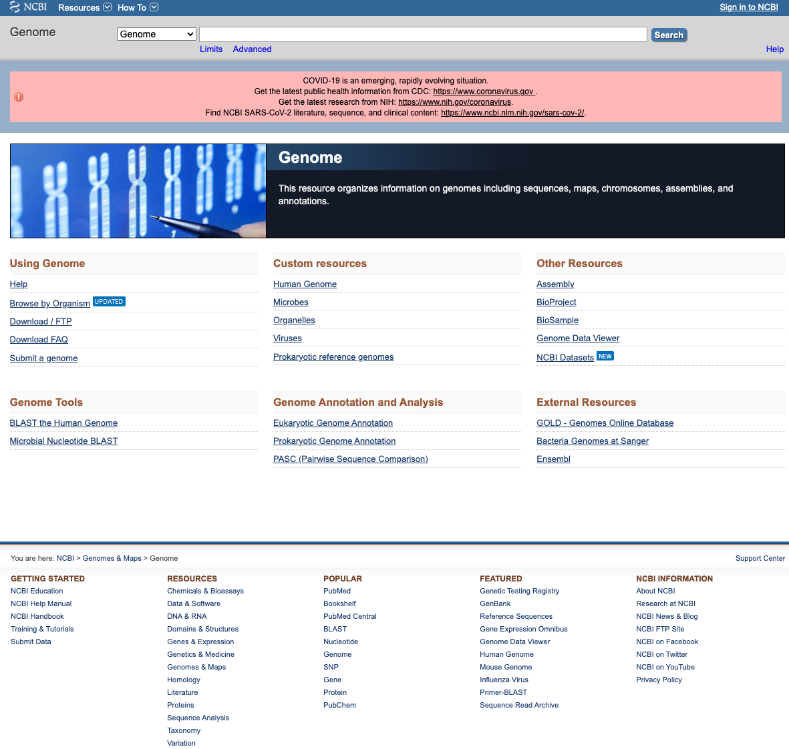 
</p>
</figure>

## Example: NCBI Genbank C. albicans

- Let's check out that old lab classic strain SC5314


<figure class="image">
<p float="center">
  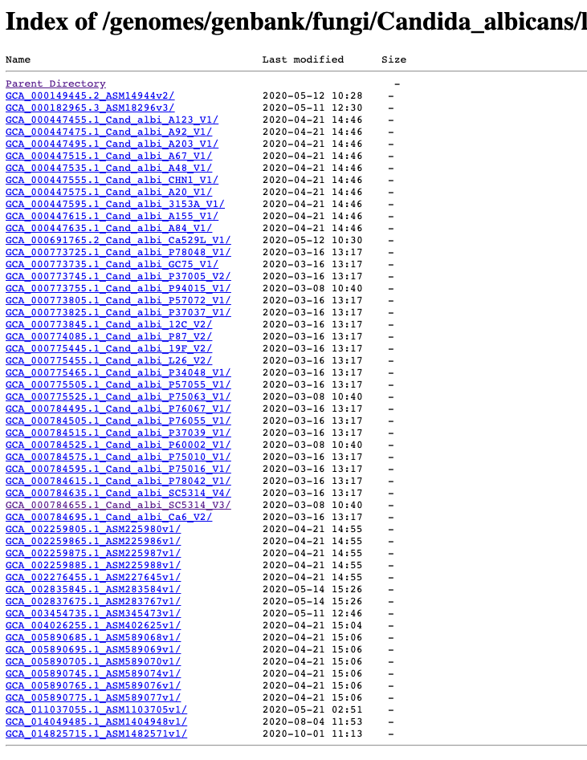 
</p>
</figure>


## Example: NCBI Genbank C. albicans


<figure class="image">
<p float="left">
  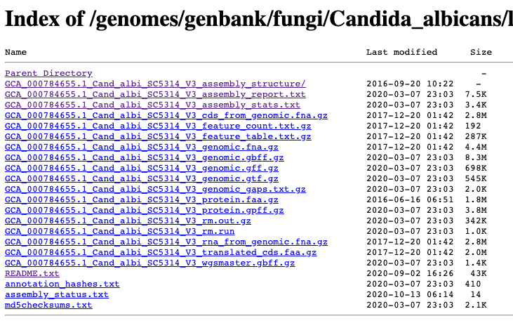 
  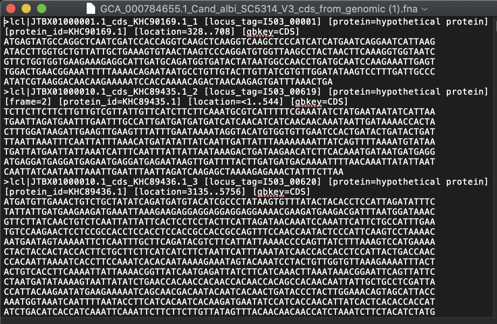 
</p>
</figure>

- cds = coding sequence. rm = Repeat Masker. features = genes/exons. 

- fna = FASTA nucleic acid. faa = FASTA amino acid.

- gbff = great best friends forever (I think). gff = Generic Feature Format. gtf = gene transfer format. 


## Different ways to download: UCSC

- [UCSC Genome Browser](https://genome.ucsc.edu/cgi-bin/hgGateway?hgsid=918274855_AzGyruacrcnN3hPj2V9DUvhPYMoY) but not all organisms are there.


<figure class="image">
<p float="left">
  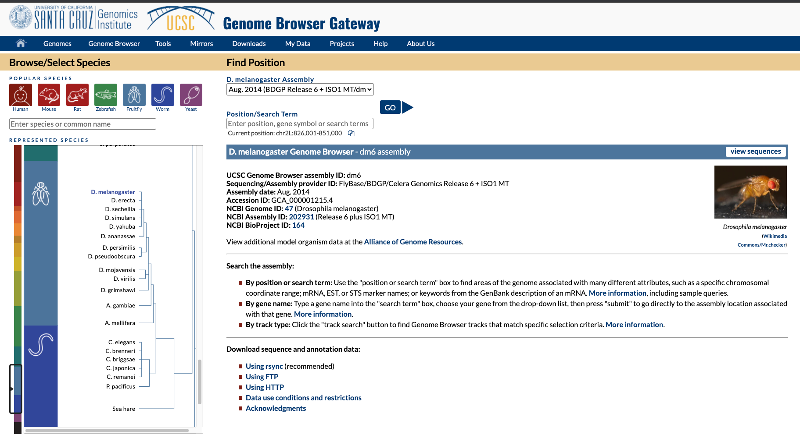 
    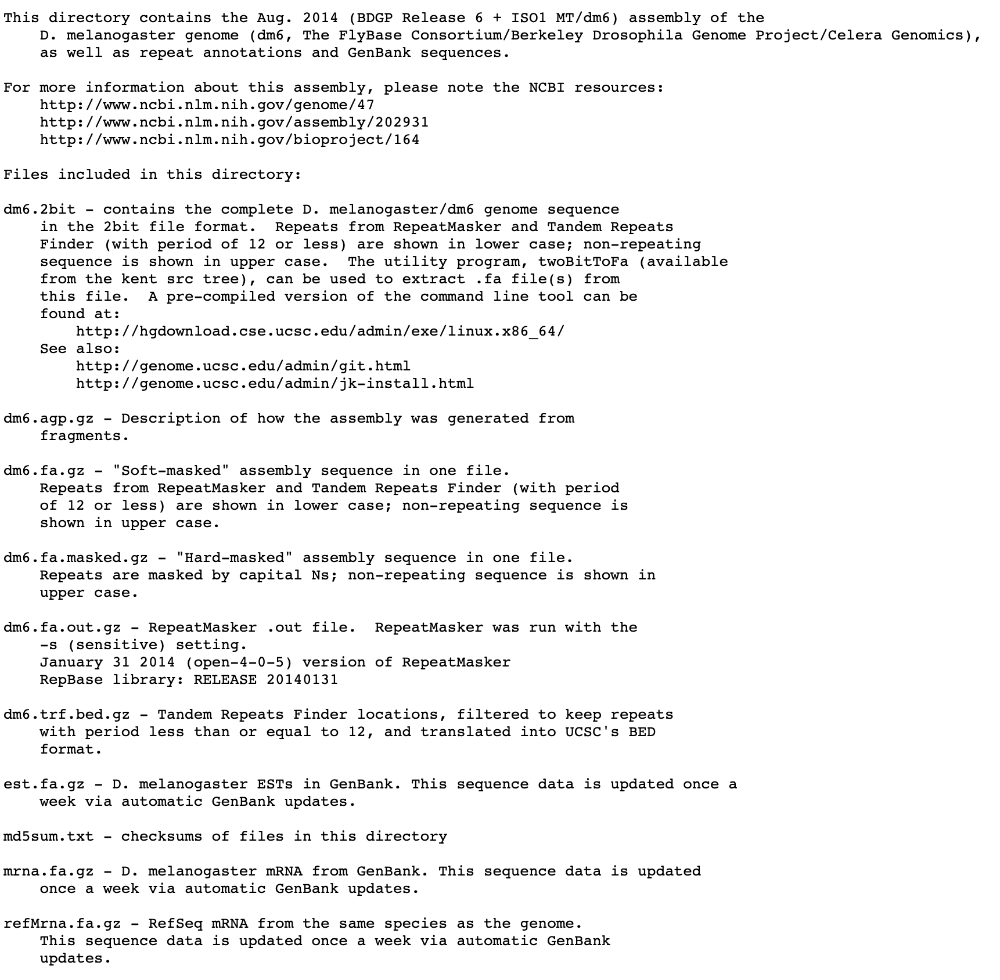 

</p>
</figure>

- masked = repeat masker. 2bit = compressed FASTA with masks. 

- bed = start:stop ranges for different genomic objects. 


## Many data formats

<figure class="image">
<p float="center">
    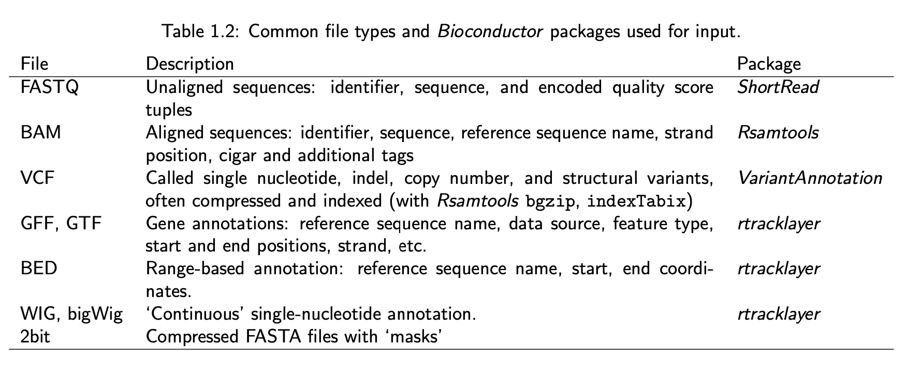 
</p>
<figcaption><small>From: Sequences, genes and genomes (2013) M Morgan
</small> </figcaption>
</figure>

[Data File Formats](http://genome.ucsc.edu/FAQ/FAQformat), a nice resource at the UCSC


## A quick note about different versions of the human genome

- There are at least three major versions of the human reference genome. One from the Genome Reference Consortium,  one from the UCSC genome browser database and one from the Broad Institute. 

- Why? Mostly the same I believe but differ slightly on a few N bases (undetermined) and how the mitochondrial genome is reported. 

 - Have you discovered [BioStars](https://www.biostars.org) yet?
 
<figure class="image">
<p float="center">
    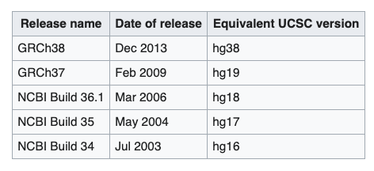 
</p>
</figure>


## From the hard drive to R.   

- NCBI has basically everything in every format. 

- One route is to download via  ${\tt ftp}$ or ${\tt wget}$ that data to your machine (actual or cloud).

- Once at your machine, getting the data into R can often tricky.

- There are R functions to read in almost all formats of bio-data. (Ok I don't know that for sure, but it's been my experience.)

- [${\tt seqinr}$](https://www.rdocumentation.org/packages/seqinr/versions/3.6-1) is a very broad and helpful package in R.

- But there are many formats and you need special _parsers_ for each format.

## Different ways to download: biomaRt

- [Ensembl](https://uswest.ensembl.org/index.html) European effort. Started wtih Human, then vertebrates and now more species. 

- [BioMart](http://uswest.ensembl.org/info/data/index.html) allows you to specify what types of data you want about each genome (much like the other tools.)

- However, it is the [BiomaRt package](http://uswest.ensembl.org/info/data/biomart/biomart_r_package.html) in R that gives you the most power.

```{r, echo=TRUE}
# library(biomaRt)
# ensembl <-  useEnsembl(biomart="ensembl")
# head(listDatasets(ensembl))
```

## More biomaRt examples

```{r, echo=TRUE}
# library(biomaRt)
# ensembl <-  useEnsembl(biomart="ensembl")
# head(listDatasets(ensembl))
```

```{r, echo=TRUE}
#ensembl <- useEnsembl(biomart="ensembl", dataset="hsapiens_gene_ensembl")

#chr22_genes <- getBM(attributes=c('ensembl_gene_id',
#'ensembl_transcript_id','hgnc_symbol','chromosome_name','start_position','end_position'), filters =
#'chromosome_name', values ="22", mart = ensembl)

# hgnc_swissprot <- getBM(attributes=c('ensembl_gene_id','ensembl_transcript_id','hgnc_symbol','uniprotswissprot'),filters = 'ensembl_gene_id', values = 'ENSG00000139618', mart = ensembl)
```

## Using BSgenome with UCSC

- It is also possible to download genomes and annotations directly into R from the UCSC Genome Browser effort.

- The ${\tt BSGenome}$ packages from Bioconductor are available for many organisms [here](https://bioconductor.org/packages/release/BiocViews.html#___BSgenome).

- The data is uploaded into a ${\tt Biostrings}$ object (more in a bit).

```{r, include=FALSE}
# BiocManager::install("BSgenome.Scerevisiae.UCSC.sacCer2")
library(BSgenome.Scerevisiae.UCSC.sacCer2)
BSgenome.Scerevisiae.UCSC.sacCer2
seqnames(BSgenome.Scerevisiae.UCSC.sacCer2)
BSgenome.Scerevisiae.UCSC.sacCer2$chrI
```


## Back in the days... characters

In _base R_ (the traditional version of the software), we had the ${\tt character}$ class.

```{r, echo=TRUE}
x <- "The rockets are distributing about London just as Poisson’s equation in the textbooks predicts"
nchar(x); substr(x, start=5, stop = 11); 
y <- "As the data keep coming in, Roger looks more and more like a prophet."
toupper(y) # not to mention tolower
```

## Back in the days... characters


```{r, echo=TRUE}
z <- cat(x, y); z  # careful
z <- paste(x, y, sep =". ")
gregexpr(pattern="on", text = z)
(gsub("Roger", "Mike", z))
```

## And then the tidyverse: stringr

- It's nicer. 

```{r, echo=TRUE}
str_length( c(x, y))
z <- str_c(x, y, sep=". ")

pizza <- TRUE
num_kids <- 3
str_c( "Ok my ", num_kids, " spawn, we should", 
       if (pizza) " order pizza." else  " eat lettuce."
       )
```

## stringr

```{r, echo=TRUE, collapse=TRUE}
str_sub( x, start=5, end=11)
str_to_upper(x)
str_sort( c("one", "two", "three", "four"))
# str_
```

## stringr

```{r, echo=TRUE, collapse=TRUE, incremental=FALSE}
str_view(c(x,y), "o.e")
str_view(c(x,y), "..$")
str_view(z, "keep(s|)")
```

## Biostrings

- Base R and stringr functions are for small short strings. 

- Genomic data is much bigger and requires special data structures to efficiently store them.

- Also, genomic data requires functions especially designed to nucleic and amino acid sequences (eg alignments which we will talk much more about over the next few weeks). 

- ${\tt Biostrings}$ is an important package for manipulating genomic strings.

## Biostrings

- Biostrings allows for DNA strings (DNAString), RNA strings (RNAString), and amino acid strings (AAString) with _generic classes_ BString and XString (more about these last two later).
```{r, echo = TRUE, collapse=TRUE, incremental=FALSE}
# BiocManager::install("Biostrings")
library(Biostrings)
dnastring = DNAString("GCGATN-CTC")
dnastring
length(dnastring)

DNA_ALPHABET
alphabetFrequency(dnastring, baseOnly=TRUE, as.prob=TRUE)
```

- [IUPAC](https://www.bioinformatics.org/sms/iupac.html). 

- The "-" indicates a gap (more about that later).


## Biostrings

```{r, echo=TRUE, collapse=TRUE, incremental=FALSE}
dnastring
reverseComplement(dnastring)
dnastring[8]
dnastring[4:10]
dnastring == reverseComplement(reverseComplement(dnastring))
view = Views(dnastring, start=3:0, end=5:8)
view
```

## Biostrings

- There is also a notion of a set of sequences

```{r, echo=TRUE, collapse=TRUE, incremental=FALSE}
dna_seqs = DNAStringSet(c("TATGCG", "TAACCG", "AATGGG", "TTACGG"))
alphabetFrequency(dna_seqs, baseOnly=TRUE, as.prob=TRUE)
dna_seqs
```

## Biostrings

```{r, echo=TRUE, collapse=TRUE, incremental=FALSE}
#BiocManager::install("BSgenome.Scerevisiae.UCSC.sacCer2")
library(BSgenome.Scerevisiae.UCSC.sacCer2)

yeast_1 <- Scerevisiae$chrI; 
class(yeast_1)
```

## Biostrings
  
```{r, echo=TRUE}
Sc <- tibble(chromosome=NA, A=NA, C=NA, G=NA, T=NA, other=NA)
for (i in 1:17) {
  tmp <- alphabetFrequency(Scerevisiae[[i]], as.prob=TRUE, baseOnly=TRUE)
  Sc <- add_row( Sc, chromosome = str_c("Chr ", i), 
                 A=tmp[1],  C=tmp[2] ,
                 G=tmp[3],  T=tmp[4], other = tmp[5] )
  }
Sc <- Sc %>% drop_na %>% pivot_longer(cols = c(A, C, G, T, other),
                                            names_to="nucleotide")
```

## Biostrings

```{r, echo=TRUE}
ggplot(data=Sc, aes(x=chromosome, y=value, fill=nucleotide)) +
  geom_bar(stat="identity") +
  theme(axis.text.x = element_text(angle = 90, vjust = 0.5, hjust=1))
```


## Points of reflection

- Which organism has the largest genome? And why on earth would such a large genome evolve in this organism?

- What are the advantages of special datastructures  for genomes and molecular sequence data?

## BIOCHEM xxxx

&copy; M Hallett, 2022 Western University


