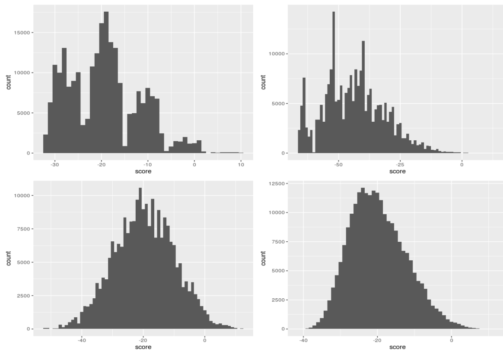
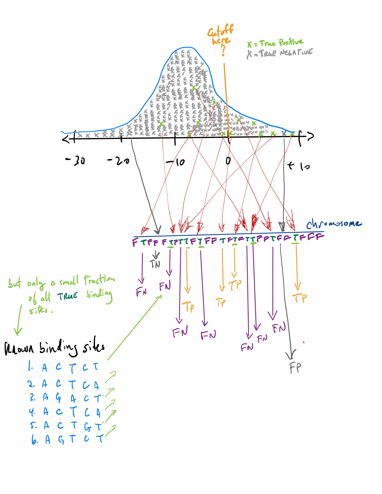

```{r setup, include=FALSE}
knitr::opts_chunk$set(echo = FALSE)
library(tidyverse)
library(Biostrings)
data_path = "~/data"
```

## Goals for today

- Object oriented programming in R: S4 objects (short note)

- Then back to computational biology ...

- Measures of performance

- Markov models

- Hidden Markov Models 

- A simple model for gene finding

## Object Oriented programming

- A complete exposition on object orient (OO) programming would take a complete course

- Our goal here is just to introduce you to this important concept

- OO is a very powerful paradigm that really helps to organize code. 

- In R, there are three different types of OO programming, ordered by "strictness" (from informal to formal):

\[ S3 < S4 < RS = R5 < R6
\]

- Let's not worry about why there are so many flavours of OO programming, but just focus on $S4$ as a compromise.

## The basic concepts of OO programming

- OO programming begins with the concept of a ${\tt class}$.  Here we can make new classes on demand. 

- For example, we can think of genomes as a class. Individual objects of this class correspond to a single genome. So there would be an object ${\tt Scerevisiae}$ for the genome of yeast and an object ${\tt Hsapiens}$ for human etc. 

- To create a ${\tt Genome}$ class in R, we can use the ${\tt setClass}$ function from the R base language.

- The ${\tt setClass}$ function has several required arguments, and many optional arguments that more advanced practioners would use to ensure good programming style.

- Now each ${\tt Genome}$ object can have several attributes or properties. These are stored in ${\tt slots}$ of the object. For example each genome object would have a name (of the organism), and perhaps a 
${\tt DNAStringSet}$ to contain the chromsomes, plus many more attributes for annotations.

## A genome class

```{r, echo=TRUE, collapse=TRUE, incremental=FALSE}
Genome <- setClass (
  "Genome",        # Set the name of the class. Often people start with uppercase
  
  slots = c(
    organism_name = "character",
    chromosomes = "DNAStringSet",
    annotations = "data.frame",
    chromosome_names = "data.frame",
    GO = "data.frame"
  ), # end of slots
  
  prototype = list(          # set the default values for each slot (optional)
    organism_name = "",    chromosomes = DNAStringSet(), 
    annotations = data.frame(), chromosome_names = data.frame(),
    GO = data.frame()
  ), # end of prototype
  
  # This fucntion can check that the data in your object is consistent;
  validity = function(object) {}  # it doesn't do anything. 
) # end of genome class
```

## Instantiating objects of class GENOME

- Now we can create objects of class ${\tt Genome}$ passing different arguments to fill the slots.

```{r, echo=TRUE, collapse=TRUE, incremental=FALSE}
bland <- Genome()
(bland)                # the slots have default settings
bland@organism_name    # note the use of the @ operator to access slots
bland@chromosomes
```

## Instantiating objects of class GENOME

```{r, echo=TRUE, collapse=TRUE, incremental=FALSE}
# data_path <- "/cloud/project/data"      #  for RStudio Cloud
anno <- read_rds( file.path( data_path, "annotations_1.0.rds" ))
sc <- read_rds( file.path( data_path, "sc_1.0.rds" ))
sc_meta <- read_rds( file.path( data_path, "sc_meta_1.0.rds" ))
go <- read_rds( file.path( data_path, "GO.rds" ))

Scerevisiae <- Genome(organism_name = "Saccharomyces cerevisiae",
                     chromosomes = sc,
                     chromosome_names = sc_meta,
                     annotations = anno,
                     GO = go)
Scerevisiae@organism_name
Scerevisiae@annotations
length(Scerevisiae@chromosomes[[3]])
write_rds( Scerevisiae, file.path( data_path, "Scerevisiae_vers_1.0.rds" ))
```

## Methods associated wtih classes

- Sometimes we want to have specific methods (functions) that operate on our objects. 

- Recall the ${\tt my\_scan}$ function from last class that takes a binding site and searchers for it in the target sequence.

- We won't explore this functionality here. 

## Now back to computational biology

- What is a model? 

- Why are they important?

- How do we build a model?

- How do we parameterize or train a model?

- __How do we evaluate its performance?__

- How do we validate a model?

## TF binding sites revisited

- We left off last class with this figure describing the distribution of log-odds ratio of 4 TFs across chromosome 3 of yeast.


<figure class="image">
<p float="center">
   
</p>
</figure>

- The question is where to set the point along the $x$-axis to call scores to the right as putative TF bindings sites and scores to the left  as random hits.

## Classifiers

- If you set a point along the $x$-axis, any point to the right corresponds to a score from a position somewhere in the chromosome. This position in the chromosome would be classified as a positive hit, an actual  binding site for the TF.

- Any point to the left corresponds to a score from a position somewhere in the chromosome that is not strong enough to be classified as binding site. It is classified as a negative. hit.

- The reality, which you do not know but which you are trying to "learn", is that each position along the chromosome is either true binding site or false binding site. 

- If we predict a position in the chromosome to be a binding site, and it truly is, we call it a __True Positive (TP)__. 

- If we predict it not to be a binding site and it really is not a binding site, we call it a __True Negative (TN)__.

- If we predict a position in the chromosome to be a binding site, and it  is not, we call it a __False Positive (FP)__. 

- If we predict a position in the chromosome not to be a binding site, and it  truly is, we call it a __False Negative (FN)__. 

## TP, FP, TN, FN

<figure class="image">
<p float="center">
   
</p>
</figure>

## Measures of performance

\[  Sensitvity = \frac{\#TP}{\#TP+\#FN} \]

\[   Specificity = \frac{\#TN}{\#TN + \#FP} 
\]

\[ Accuracy = \frac{\#TP + \#TN}{\#TP + \#FP + \#TN + \#FN}
\]

- (Many other related notions, some of which we will explore later.)

- But TP, FP, TN, and FN are difficult to know for the TF binding site problem. Which are the most problematic?


## Training and testing

- Another issue in the approach above is that the motifs that were used to train our model (the position weight matrix) were used in the evaluation of its performance.

- The required reading starts to touch on this issue and we will explore it more today. 

- Briefly here, whatever data you use to train your model should be kept completely separate than the data used to validate your model. 

- One simple approach in this direction would be to train the model using only half of the binding sites (eg 3 of 6) and use the other half to compute TP, FP, TN, FN. Why is this not quite correct either?

## Goals for today

- Object oriented programming in R: S4 objects (short note)

- Then back to computational biology ...

- Measures of performance

- Markov models

- Hidden Markov Models 

- A simple model for gene finding

- (We switch now to some hand written notes.)


## Points of reflection

- What are some of the differences between predicting genes in eukaryotic versus prokaryotic genomes?

- Besides nucleotide frequency, what other genomic properties could be used to predict the location of genes?

- What are the advantages of object oriented programming?


## BIOCHEM xxxx

&copy; M Hallett, 2022 Western University


