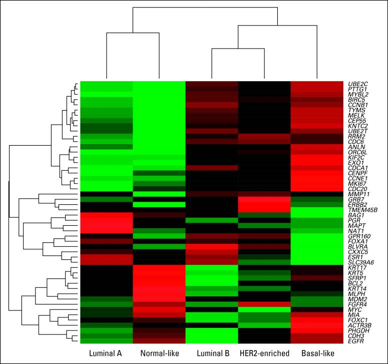

```{r setup, include=FALSE}
knitr::opts_chunk$set(echo = FALSE)
library(tidyverse)
data_path = "~/data"
library(knitr)
df <- tribble( ~input, ~`paired with`, ~output,
              #--------|--------------|--------,
              "x[1]", "\u2192", "y[1]",
              "x[2]", "\u2192", "y[2]",
              "\u2022\u2022\u2022", "\u2022\u2022\u2022", "\u2022\u2022\u2022",
              "x[N]", "\u2192", "y[N]"
               )
df2  <- tribble( ~`height`, ~`weight`, ~`IQ`, ~`education`, ~`paired with`, ~output,
              #--------|--------------|--------,
              "x[1,1]", "x[1,2]","x[1,3]","x[1,4]", "\u2192", "y[1]",
              "x[2,1]", "x[2,2]","x[2,3]","x[2,4]", "\u2192", "y[2]",
              "\u2022\u2022\u2022", "\u2022\u2022\u2022", "\u2022\u2022\u2022", "\u2022\u2022\u2022", "\u2022\u2022\u2022", "\u2022\u2022\u2022",
              "x[N,1]", "x[N,2]","x[N,3]","x[N,4]", "\u2192", "y[N]",
               )
```


## Goals for next two lectures


- k means clustering (unsupervised analysis) to discover subtypes in breast cancer transcriptomic data.

- Linear regression models (supervised analysis) to predict patient outcome from breast cancer transcriptomic data.


## Breast cancer subtypes

- Revisit Lecture 3. 


<figure class="image">
<p float="left">
   
</p>
<figurecaption>From Parker et al. (2010) The PAM50 breast cancer subtypes.</figurecaption>
</figure>

## Predicting outcome from transcriptional profiles

- Revisit Lecture 6 especially the end. There we were classifying tissue type not outcome, but the principle is the same.


## BIOL 480

&copy; M Hallett, 2020 Concordia University


