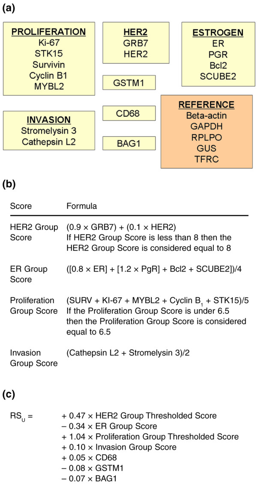
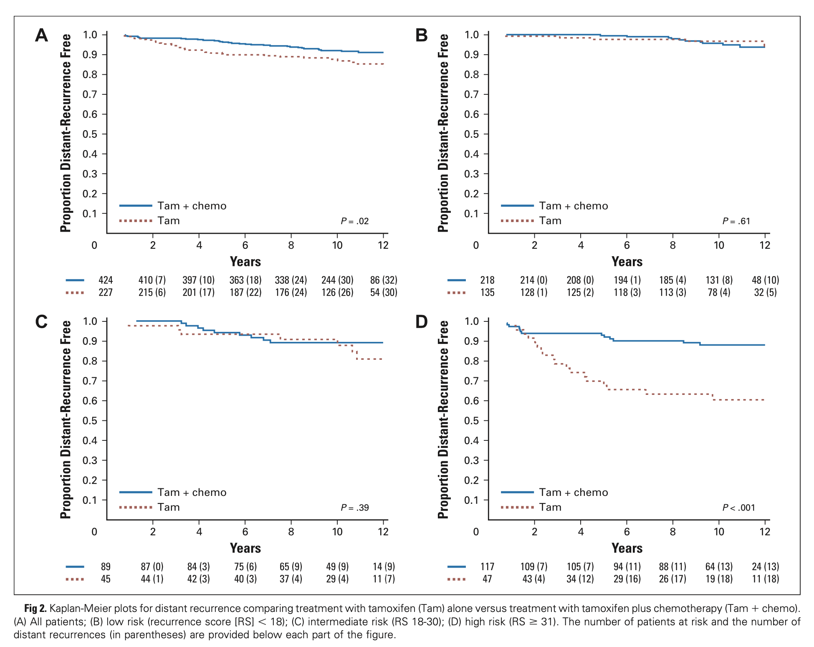
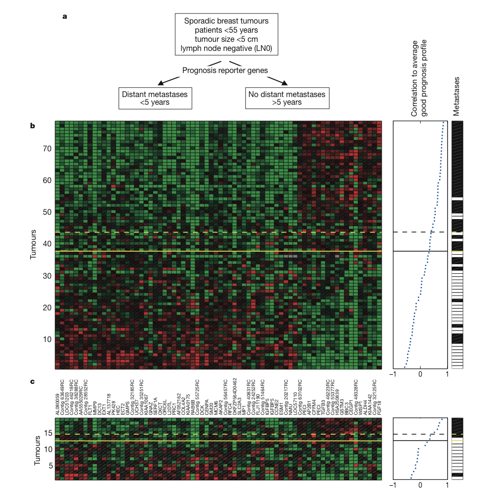

```{r setup, include=FALSE}
knitr::opts_chunk$set(echo = FALSE)
library(tidyverse)
data_path = "~/data"
library(knitr)
df <- tribble( ~input, ~`paired with`, ~output,
              #--------|--------------|--------,
              "x[1]", "\u2192", "y[1]",
              "x[2]", "\u2192", "y[2]",
              "\u2022\u2022\u2022", "\u2022\u2022\u2022", "\u2022\u2022\u2022",
              "x[N]", "\u2192", "y[N]"
               )
df2  <- tribble( ~`height`, ~`weight`, ~`IQ`, ~`education`, ~`paired with`, ~output,
              #--------|--------------|--------,
              "x[1,1]", "x[1,2]","x[1,3]","x[1,4]", "\u2192", "y[1]",
              "x[2,1]", "x[2,2]","x[2,3]","x[2,4]", "\u2192", "y[2]",
              "\u2022\u2022\u2022", "\u2022\u2022\u2022", "\u2022\u2022\u2022", "\u2022\u2022\u2022", "\u2022\u2022\u2022", "\u2022\u2022\u2022",
              "x[N,1]", "x[N,2]","x[N,3]","x[N,4]", "\u2192", "y[N]",
               )
```


## Goal today


- Linear regression models (supervised analysis) to predict patient outcome from breast cancer transcriptomic data.

- Revisit Lecture 6 especially the end. There we were classifying tissue type not outcome, but the principle is the same.


## Oncotype DX

- RT-PCR based assay from FFPE (fixed formalin, paraffin embedded) material availabe from GenomeHealth Inc.

<figure class="image">
<p float="center">
   
</p>
<figurecaption>From [Oncotype Dx](https://www.breastcancer.org/symptoms/testing/types/oncotype_dx).
</figure>

## Oncotype DX

<figure class="image">
<p float="center">
   
</p>
<figurecaption>From [Oncotype Dx](https://www.breastcancer.org/symptoms/testing/types/oncotype_dx).
</figure>

## MammaPrint

- Originally microarray based. Can also use FFPE material. Available from Agendia Inc.

<figure class="image">
<p float="center">
   
</p>
<figurecaption>From [van 't Veer et al (2002) Gene expression profiling predicts clinical outcome of breast cancer. Nature](https://pubmed.ncbi.nlm.nih.gov/11823860/).
</figure>


## BIOCHEM xxxx

&copy; M Hallett, 2022 Western University


