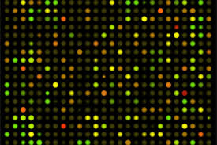

```{r setup, include=FALSE}
knitr::opts_chunk$set(echo = FALSE)
```

## Outline for today

- Introduce myself

- Provide context for the course

- Discuss logistics of the course 

- Discuss what is expected of you and I

## Me 

[https://mikehallett.science](https://mikehallett.science) My lab website<br>
[Data science for biologists](https://jolly-curran-f9c8ba.netlify.app/) Course Website


${\tt michael.hallett@concordia.ca}$ e-mail<br>
${\tt @hallettmichael}$  Twitter<br>

<figure class="image">
<p float="left">
   
   
</p>
<figcaption> Left is our website; Right is a live action shot of the group preparing for our yearly workshop at the Bellairs Research Insitute, Barbados.</figcaption>
</figure>

## Early '90s


<figure class="image">
<p float="left">
   
   
   

</p>
<figcaption> Left. Me doing my PhD at the Univerity of Victoria and Sombrio Beach; 
Centre Early efforts to push the Human Genome Project forward; Right. A figure from my
PhD thesis.</figcaption>
</figure>

## Mid- to Late-'90s


<figure class="image">
<p float="left">
    
     
     
  </p>
</figure>
<figcaption>Left: Zuerich. Center: 1st genome, H. influenzae 1.8M base pairs. (1995). Right: 1st complete draft of H. sapiens  3.7B b.p. (2001)</figcaption>

Even for the bacteria like H. influenzae,  slow-throughput technologies
were simply not enough to sequence complete genomes. It took
high-throughput approaches to make it feasible.

$1,800,000 = 1.8 \cdot 10^6$ vs $3,600,000,000 = 3.6 \cdot 10^9$ base pairs.  Three orders of magnitude in $5$ years.

## Rapid growth and diversification

In addition to increased sequencing capacity, many other high-throughput technologies that measured different levels of the centra dogma of biochemistry came on-line.

<figure class="image">
<p float="left">
    
     
     
  </p>
</figure>
<figcaption>Left: Microarrays for transcriptomics. Center: Robotic screening facilities for drug discovery. Right: Mass spectrometry for proteomics.</figcaption>

And many additional "-omics" approaches. 

Technology based on
robotics, micromanipulation, nanofabrication, lasers, 
photolithography, microfluidics, microscopy ...

Driven by a better understanding of protein and small molecule biochemistry, and a robust calculus of ways to manipulate nucleic acids (molecular biology).

## 2000's

I moved to McGill as a professor in 2000. Became  interested in cancer genomics and informatics.

The early 2000s saw a commoditization of equipment,
the ability to apply these technologies in human contexts,
and the development of so-called **core** facilities.

<figure class="image">
<p float="left">
     
    
     
  </p>
</figure>
<figcaption>Left: BGI (China) Sequencing Facility. Center: Coordinate efforts such as TCGA to profile cancers at many levels. Right: Breast cancer has many molecular diverse subtypes.</figcaption>

## 2010's

Moved to  Concordia in 2018. We are interested in how cells are wired (the molecular network), how this wiring can change  in response to stimuli, and how the changes in the network provide cells with advantages.

<figure class="image">
<p float="left">
    
      
  </p>
</figure>
<figcaption>Left: No CRISP/Cas9 doesn't really look like this. Right: Indeed, Synthetic Biology does involve tiny women changing colourful nucleotides.  </figcaption>

Single cell profiling have blossomed, permanently changing every area of life science research.
<figure class="image">
<p float="center">
    
  </p>
</figure>

## Bioinformatics, Computational Biology and Data Science

[Data Science in Biology] The ability to develop software and analytic approaches to wrangle with biological  data, clean it up, kick it into shape and visualize it in a way that is both informative and honest.


[Bioinformatics] The development of tools, portals and databases to make biological information available to all life scientists. 

[Computational Biology] The development of new analytic techniques, typically expressed as computer programs, to explore biological data and test hypotheses.

This course will you give you the fundamentals in all three disciplines with an emphasis on data science.

##  <strike>Computational</strike> Biologist


- <u>Ice</u> Hockey  $\mapsto$ huh?
- <u>Hot</u> Sun, <u>Hard</u> Rock... and many other useless adjectives.
- <u>Field</u> Hockey $\mapsto$ unfortunate misuse of word "hockey".
- <u>Field</u> Ball-Club Game  $\checkmark$
- (<u>Road Hockey</u> ... ok English is weird sometimes ... a valid Canadian game in summer)
- $\Rightarrow$ Hockey is ice hockey, therefore "ice"  is obvious from the context and therefore no need to state explicitly.
- <strike>Ice</strike> Hockey

- <u>Computational</u> Biologist $\mapsto$ huh?
- <u>Non-computational</u> Biologist ?, <u>Luddite</u> Biologist ?
- <u>Cave</u> Biolgist ?
- $\Rightarrow$ All biology is about information/computation, therefore all biologists are computational biologists (maybe just not good ones)
- <strike>Computational</strike> Biologist


## Much information "hidden" in bioinformatics databases


<figure class="image">
<p float="left">
    
    
  </p>
</figure>
<figcaption>Left: Number of papers that mention ESR1 in PubMed. Right: Number of recorded experiments/assays that have studied ESR1.</figcaption>

...  _everytime_ a human cell is sequenced ESR1 or its gene products are profiled. 

Clearly, if you lack bioinformatic and data science skills, you are restricted to just reading manuscripts. 

## Outline for today

- Introduce myself $\checkmark$

- Provide context for the course $\checkmark$

- Discuss logistics of the course $\Leftarrow$

- Discuss what is expected of you and $\Leftarrow$

... but before re-directing to our course website, ...


## Some advice


- Bioinformatics, computational biology, data science are 
important.
- You need these skills; you cannot realistically expect to participate in modern biology without them.
- The good news is that data science is an experimental science, just like what you are used to.
- The primary means of doing experiments is through  statistics and computation.
- This requires programming.
- Learning to program is like learning a natural language.
- It is a serious investment. It takes an open mind and practice.


---

BIOL480 

&copy; M Hallett, 2020 Concordia University


