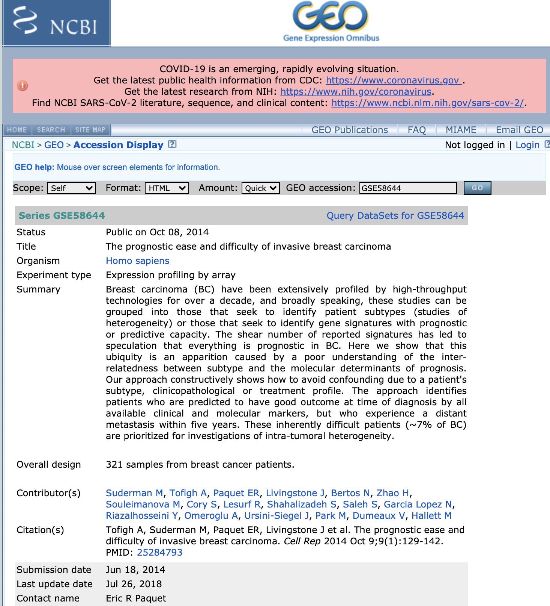

```{r setup, include=FALSE}
knitr::opts_chunk$set(echo = FALSE)
```

## Plan for Today

- Continue with Les Stroud's  [Survivorman](https://www.youtube.com/watch?v=yNxro4Nn_Ok)

- [Tara Oceans](https://oceans.taraexpeditions.org/en/)  

- [Sunagawa et al. (2015) Structure and function of the global ocean microbiome. Science](https://science.sciencemag.org/content/348/6237/1261359.long)

- [Sunagawa et al. (2015) Supplemental Data](http://ocean-microbiome.embl.de/companion.html)


## Map of where we are


<figure class="image">
<p float="center">
   
</p>
<figcaption><small> From R for Datas Sience, Chapter 6.
</small> </figcaption>
</figure>


- But before returning to Survivorman ...
 
## Other mandates for Bioinformatics

- We talked earlier about issues of storing data and making it accessible. 

- There are at least _four_ additional mandates for the field of Bioinformatics related to standards.

1. Standards for data representation
2. Standards for software and data structures
3. Standards and policy for ethics and data sharing
4. Standards for reproducibility

 
## Standards for data representation

- For __data__, this is primarily about setting formats for how data is uploaded to a public database, and what type of metadata is needed. For example:

   -- The [MIAME standard](http://fged.org/projects/miame/) and fsubsequent formats for other data types at [FGED](http://fged.org/).

   -- uploads to the NCBI
   
<figure class="image">
<p float="center">
   
</p>
<figcaption><small>One of our GEO entries for breast cancer dataset.
</small> </figcaption>
</figure>


## Standards and policy for ethics in biology 

- [The Bermuda Policy](https://en.wikipedia.org/wiki/Bermuda_Principles#:~:text=The%20Bermuda%20Principles%20set%20out,of%20humans%20and%20other%20organisms.)

- [International Society for Computational Biology (ICSB)](https://www.iscb.org/)

## Standards for reproducibility

- [Massive Analysis and Quality Control (MAQC)](https://pmgenomics.ca/maqcsociety/?) society

- We will revisit issues of reproducbility near the end of the course.


<figure class="image">
<p float="center">
   
</p>
<figcaption><small> From R for Datas Sience, Chapter 6.
</small> </figcaption>
</figure>


## Software and data structure standards

- For __software__, this often is about standarizing the data structures used to represnt a specific type of biological data.

- Eg FASTA format for sequence data, Newick format for phylogenetic trees, PDB files for protein structure, etc.

- [Bioconductor](https://www.bioconductor.org/) provides tools for the analysis and comprehension of high-throughput genomic data. Bioconductor uses the R statistical programming language, and is open source and open development.

- Bioconductor develops standards for  data storage in different domains.
 -- [single cell expression](https://scrnaseq-course.cog.sanger.ac.uk/website/introduction-to-rbioconductor.html#bioconductor-singlecellexperiment-and-scater).
 
- Bioconductor provides R packages for download. These are installed a bit differently than "normal" R packages.

## Packages in R.

- To date, you have been using the ${\tt library}$ function to load a specific package like the ${\tt tidyverse}$. For example, ${\tt library(tidyverse)}$

- The ${\tt library}$ loads that package from your disk (at the RStudio Cloud server) into your session.

- But where did this package come from? 

- You will notice a ${\tt Packages}$ option in the lower right quadrant of RStudio. This lists all the package that are available to you. 

- If you want a package, you need to download it first to your disk. This window allows you to do it cnveniently from a R package repository such as CRAN...

## Installing packages

- Another way is to download the package yourself from the [Comprehensive R Archive Network (CRAN)](https://cran.r-project.org/).

- For example, ${\tt install.packages(tidyverse)}$ downloads the tidyverse package. That gets it to your disk and ready to be loaded into your session.

- Now ${\tt library(tidyverse)}$ loads the library from your disk into your R session.


- (You can also submit _your_ package to CRAN, and they will make it available globally, but they enforce rules and standards to ensure compatability and good practices.)


## Other R repositories

- CRAN is one place get R repositories.

- A second is from Bioconductor. You download and install Bioconductor packages a bit differently.

- First you need the Bioconductor package itself:

```{r, echo=TRUE}
#if (!requireNamespace("BiocManager", quietly = TRUE))
#    install.packages("BiocManager")
#BiocManager::install()
#BiocManager::install(c("GenomicFeatures", "AnnotationDbi"))
#BiocManager::available()
```
 ... now back to our regularly scheduled program.

## Survivorman's  goals last class

- To understand the nature of the data at Sunagawa et al.

- Some Unix.

- The notion of a ${\tt raw}$ folder

- ${\tt wget}$ in Unix to download straight to RStudio Cloud.

- Using Google to find a way to import a multi-sheet spreadsheet.

- We ended with the realization that it was uploaded as a ${\tt list}$.

## Survivorman's  goals: today

- Finish importing the Tara Oceans data and learn some more R along the way

- The ${\tt list}$ data structure

- ${\tt factors}$

- The principles of tidy data 

- ${\tt longer, wider, seperate, unit}$

- ${\tt intersect, setdiff, union}$

- Inner and outer joins.

## Now ...

- Back on location on our remote south pacific island...


## BIOCHEM xxxx on location


&copy; M Hallett, 2022 Western University


