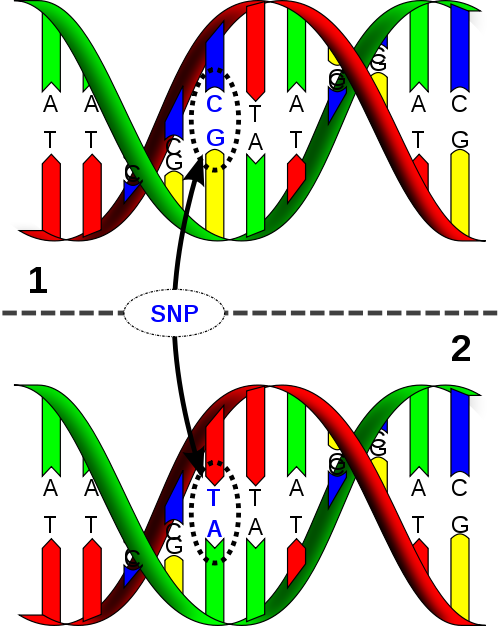

```{r setup, include=FALSE}
knitr::opts_chunk$set(echo = FALSE)
library(tidyverse)
library(Biostrings)
library(BSgenome.Scerevisiae.UCSC.sacCer2)
```

## Biostrings: tools to manipule genetic strings

- Last lecture we finished with a partial exploration of the Biostrings package in R. 

- We saw various functions applied to ${\tt DNAstring}$ datastructures. 

- ... and we used the ${\tt BSgenome}$ package to quite seamlessly import full genomes into R. (Naming convention: ${\tt BSgenome.Organism.Provider.BuildVersion}$)

```{r, echo=TRUE, collapse=TRUE, incremental=FALSE}
dnastring = DNAString("ATGATAAAAGAA")
dnastring
length(dnastring)
reverseComplement(dnastring)
translate(dnastring)
library(BSgenome.Scerevisiae.UCSC.sacCer2)
yeast_1 <- Scerevisiae$chrI; 
yeast_1
dinucleotideFrequency(yeast_1, as.prob=TRUE)
```


## Biostrings

- String (Biostrings)

   -- Virtual class

   -- Concrete subclasses:

      -- BString – Any “biological” sequence

      -- DNAString – DNA sequence

      -- RNAString – RNA sequence

      -- AAString – Amino acid sequence

```{r, echo=TRUE, collapse=TRUE, incremental=FALSE}
(RNAString(dnastring))
a <- AAString("MARKSLEMSIR*")
class(a)
```
  
## The BSgenome series of packages

- BSgenome is a series of packages that import the complete genome of different organisms into R and represents them as Biostrings.

```{r, echo=TRUE, collapse=TRUE, incremental=FALSE}
# BiocManager::install("BSgenome")
# BiocManager::install("BSgenome.Hsapiens.UCSC.hg19")
library(BSgenome)
available.genomes()
library(BSgenome.Hsapiens.UCSC.hg19)
print(Hsapiens)
print(Hsapiens$chr22)
```

## GSgenome and Biostrings

- See if you can figure out the ${\tt sapply}$ function.

```{r, echo=TRUE, collapse=TRUE, incremental=FALSE}
sapply(seqnames(Hsapiens),
 function(seqname)
 alphabetFrequency(Hsapiens[[seqname]], baseOnly=TRUE, as.prob = TRUE))
```


## Biostrings

- Here are two ways to ask if a specific pattern is present in one sequence ${\tt matchPattern}$ or a set of sequences ${\tt vmatchPattern}$. Pattern matching and alignments are very central in biology.

```{r, echo=TRUE, collapse=TRUE, incremental=FALSE}
chr2 <- Hsapiens$chr2
matchPattern( "ATGATAAAAGAA", chr2 )
vmatchPattern( "ATGATAAAAGAA", Hsapiens)
```


## Biostrings

- This is also an example of an alignment, but here N matches any nucleotide. This is an example of a regular expression.


```{r, echo=TRUE, collapse=TRUE, incremental=FALSE}
PpiI <- "GAACNNNNNCTC"  # a restriction enzyme pattern
(align.PpiI <- matchPattern(PpiI, Hsapiens[[1]][17000:23000], fixed=FALSE))
```

## Biostrings

- There are more biologically relevant notions of alignment that ultimately are based in models of evolution. We will learn these in part 3 of the course.

```{r, echo=TRUE, collapse=TRUE, incremental=FALSE}
aligns <- pairwiseAlignment("ACTTACAGATTCGATGGAC", 
                            "CCCGATACTACGGAGATTCCGATGACATATGC",
                            type = "global-local")
(aligns)
```

## Biostrings

- We will later explore several different notions of alignment.

- BLAST is perhaps the best known "industrial strength" tool for alignments (available at the NCBI).

<figure class="image">
<p float="center">
     
</p>
</figure>


## Annotations

- We can annotate the genomes. For example, we can include single nucleotide polymorphims (mutations that have been observed between indivduals).

- [1000 Genomes Project](https://www.internationalgenome.org/)

- [Genome-wide association and transcriptome studies identify target genes and risk loci for breast cancer](https://www.nature.com/articles/s41467-018-08053-5#:~:text=Genome%2Dwide%20association%20studies%20(GWAS)%20have%20detected%20more%20than,risk%20of%20breast%20cancer2.)

- [Large-scale GWAS reveals insights into the genetic architecture of same-sex sexual behavior](https://science.sciencemag.org/content/365/6456/eaat7693)


<figure class="image">
<p float="center">
     
</p>
</figure>

## Annotations

```{r, echo=TRUE, collapse=TRUE, incremental=FALSE}
available.SNPs()
# BiocManager::install("SNPlocs.Hsapiens.dbSNP.20101109")
library(SNPlocs.Hsapiens.dbSNP.20101109)

SnpHsapiens <- injectSNPs(Hsapiens, "SNPlocs.Hsapiens.dbSNP.20101109")
 snpcount(SnpHsapiens)
 head(snplocs(SnpHsapiens, "chr1"))
```


## Addition packages

- There are several additional packages that are very important for 
deadling with large genomes, especially human.

- ${\tt annotatR}$ is great for epigenetics and SNP (single nucleotide polymorphism) studies.

- ${\tt rtracklayer}$ can create and plot tracks like we see in the UCSC genome browser.


<figure class="image">
<p float="center">
   
</p>
<figcaption><small>From _Sequences, genomes and genes_ (2013) M. Morgan
</small> </figcaption>
</figure>


## Genome and annotations for S. cerevisiae

- Baker's yeast has served as a very important model organism.

- The genomes of this small fungi (eukaryote) has 16 chromosomes and one mitochondrial genome (total $12.1M$ bp). In total $6,275$ genes.

<figure class="image">
<p float="center">
   
</p>
</figure>

## S. cerevisiae

- [SGD](https://www.yeastgenome.org/) has long served as an excellent curated bioinformatics resource.

- Let's go live to RStudio Cloud and download its genome and annotations, and wrangle them into R.

## Points of reflection

- Why are roman numerals not a great idea?

- Why is it perhaps inconvenient to have both a portion of a file in ${\tt gff}$ format and a portion in ${\tt FASTA}$ format? What sort of punishment would be appropriate for this type of design decision?

- What is the difference between a gene, transcript and CDS at SGD?

- What are some of the different types of entities that are cataloged and mapped to the genome of baker's yeast?

## BIOL 480

&copy; M Hallett, 2020 Concordia University


