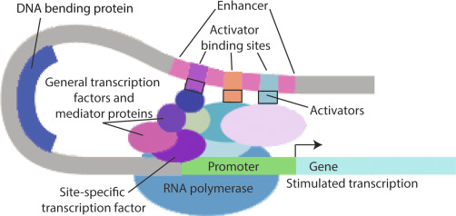
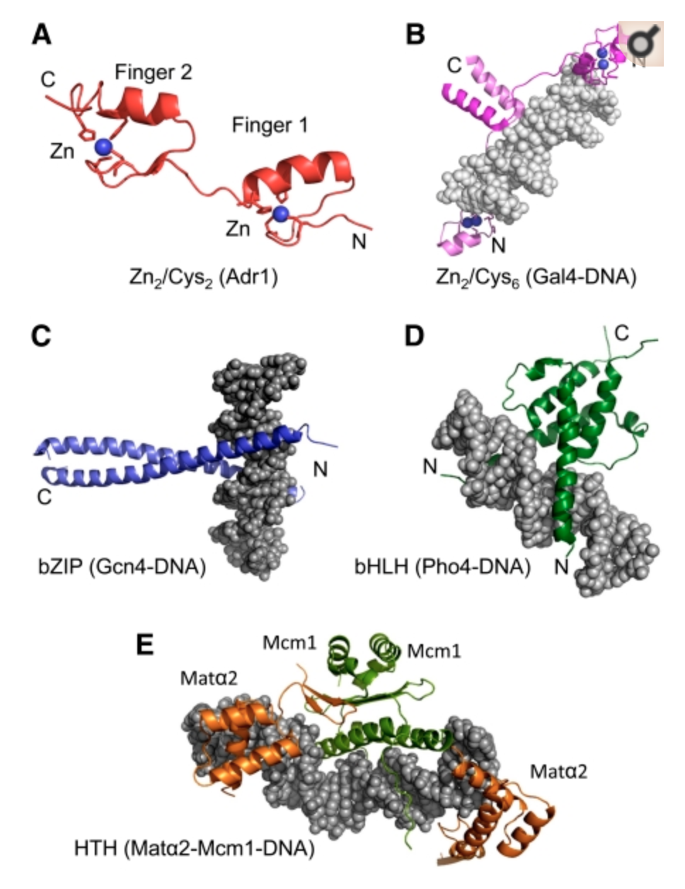
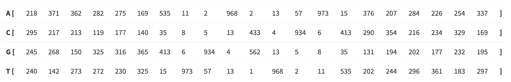

```{r setup, include=FALSE}
knitr::opts_chunk$set(echo = FALSE)
library(tidyverse)
library(Biostrings)
```

## Where we are

<figure class="image">
<p float="center">
   
</p>
<figcaption><small> From R for Datas Science, Chapter 6.
</small> </figcaption>
</figure>

## Models

- What is a model? 

- Why are they important?

- How do we build a model?

- How do we parameterize or train a model?

- How do we evaluate its performance?

- How do we validate a model?


## Models


- "All models are wrong but some are useful." [Attributed to George Box]

- "We all know that art is not truth. Art is a lie that makes us realize truth, at least the truth that is given us to understand. The artist must know the manner whereby to convince others of the truthfulness of his lies." [Picasso, Pablo (1923), "Picasso speaks"]

- “The models show hundreds of thousands of people are going to die and you know what I want to do? I want to come way under the model. The professionals did the models and I was never involved in a model. At least this kind of a model.” [An orange bouffon (Just before Nov. 3rd, 2020)]


## Transcription factors in S. cerevisiae

- What are transcription factors?

- How can we find out which proteins in S. cerevisiae are transription factors?

- What are transcription factor binding sites (TFBSs)?

- How can we locate them in S. cerevisiae?


## What is a transcription factor?

- A transcription factor (TF) is a protein that regulates the rate of transcription (DNA $\rightarrow$ mRNA) by binding to specific regions of DNA.

- TFs can work alone or in a coordinated fashion with other TFs, RNA molecules and proteins to regulate expression.

- The TF binds to DNA through a DNA Binding Domain (DBD). The amino acid sequence of the DBD determines the specific nucleic acid sequence the TF binds.

- [TFs the Movie](https://www.youtube.com/watch?v=MkUgkDLp2iE)

- [Oxford lecture](https://www.youtube.com/watch?v=Sd3imcsvXxI)


## Transcription factors bind DNA


<figure class="image">
<p float="center">
   
</p>
<figcaption><small> https://doi.org/10.1016/B978-0-12-386499-4.00005-7

</small> </figcaption>
</figure>


## Distinct families of DBDs in Yeast

- In yeast, (most) TFs bind DNA using degenerate versions of these five families of protein stuctures.

<figure class="image">
<p float="center">
   
</p>
</figure>


## Transcription factor binding sites

- The DBD binds DNA in a semi-specific manner. In other words, the location where the TF binds DNA via the DBD is characterized by a _degenerate  motif_. There is no one single nucleic acid sequence necesssary and sufficieint for DNA binding. Rather there is a "family" of related nucleic acid sequences, a degenerate motif.

- This is the binding motif for GCN4, a basic leucine ziper factor (bZIP) in yeast. You can see that some positions are highly determined (indices 7, 10, 12, 14) while others are variable (indices 7, 9, 11, 12, 15).


<figure class="image">
<p float="left">
   
   
</p>
<figcaption><small> From [JASPAR](http://jaspar.genereg.net/matrix/MA0303.1/).
</small> </figcaption>
</figure>


## Transcription factor binding prediction

- Broadly speaking, there are two main questions.

- __1. Find additional members of a known DNA binding motif.__ 

- Here we typically know what the binding side for a TF looks like and we are asking to find other places in the genome of an organism(s) where this TF likely binds. 

- The motif is modelled, for example, using a position weight matrix (we'll come back to this today) built from known examples of binding site (eg detemrined experimentally through SELEX experiments). Then this model is used to detect all occurences of the motfi in the genome.

- Sometimes the search is performed not only with the target genome but several additional genomes spanning a considerable evolutionary distance. The principle underlying such _phylogenetic footprinting_ approaches is that a nucleotide that is conserved across evolution is more likely to be function.

- There are many software packages to do this including PhyloScan.

- We will look at some of the fundamentals of this type of approach today.

## Transcription factor binding prediction


- __2. Discover a DNA binding motif for a specific TF.__ 

- In this approach, we do not know the DNA binding motif for a TF and we want to learn it.

- One way to do that would be to collect the promoters of a set of genes that we believe are all regulated by that TF. The idea is that the promoters should share a common motif that represents the location of binding for the TF.

- The software package [MEME](http://meme-suite.org/) is a classic example of this type of approach. It takes as input the DNA of a group of related sequences and identifies the sequence motifs that are most shared across this set of sequences. For example, you might give the promoters for a specif gene from several fungi. (MEME is really a suite of related appraoches that different in subtle but important ways.)

-  [HOMER](http://homer.ucsd.edu/homer/introduction/basics.html) is a conceptually-related but distinct approach. HOMER takes as input two sets of promoters. The first set might consist of promoters from genes that are highly expressed when the TF is activated compared to normal levels of the TF. The second set of promoters are from genes that are  beleive not to be regulated by the TF. The intuition is that motifs that are enriched in the first but depleted in the second are more likely to be TF binding sites.


## Transcription factors in S. cerevisiae

- How can we find out which proteins in S. cerevisiae are transription factors?

- [Gene Ontology consortium](http://geneontology.org/)

- [Gene Ontology for S. cerevisiae (from SGD)](https://www.yeastgenome.org/)

- [AmiGO](http://amigo.geneontology.org/amigo/dd_browse), a nice tool for visualy exploring GO

## A simple model for TF binding sites

(switch to notes)

## Points of reflection

- Our model is very simple. Name some of aspects of DNA-protein interactions that are not captured by our model.

- What other aspects of gene regulation are not well modelled by our approach?

- How could we improve our mdoel to better reflect the bioogical reality of transcription factors, binding sites and gene regulation in general?

- Pseudocounts are said to adjust our "prior belief" in certain events. Here what effect does adding the pseudocount to the position matrix have?

## BIOL 480

&copy; M Hallett, 2020 Concordia University


