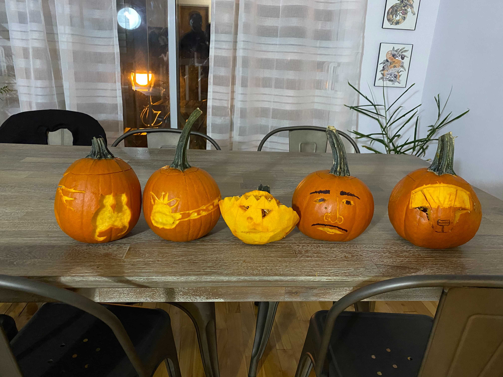
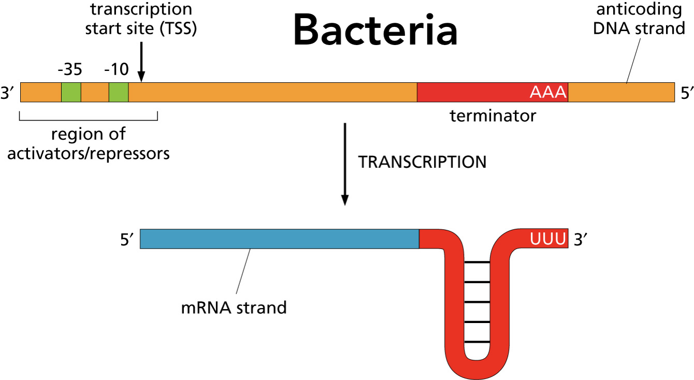
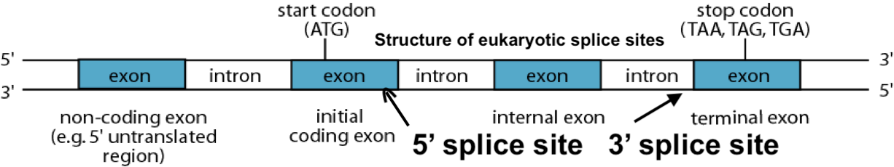
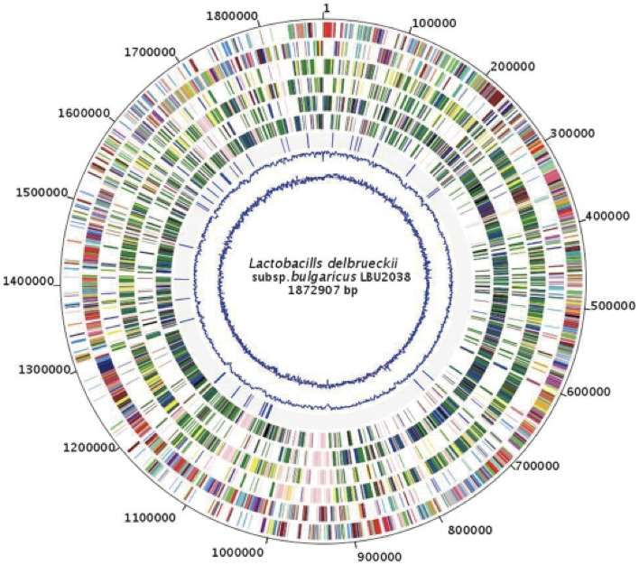
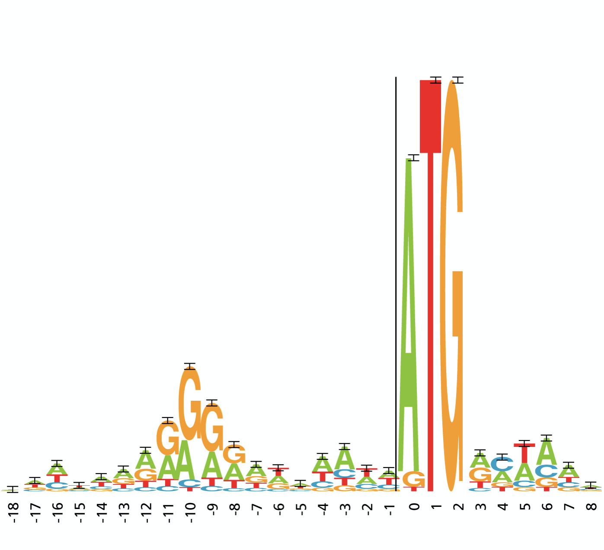
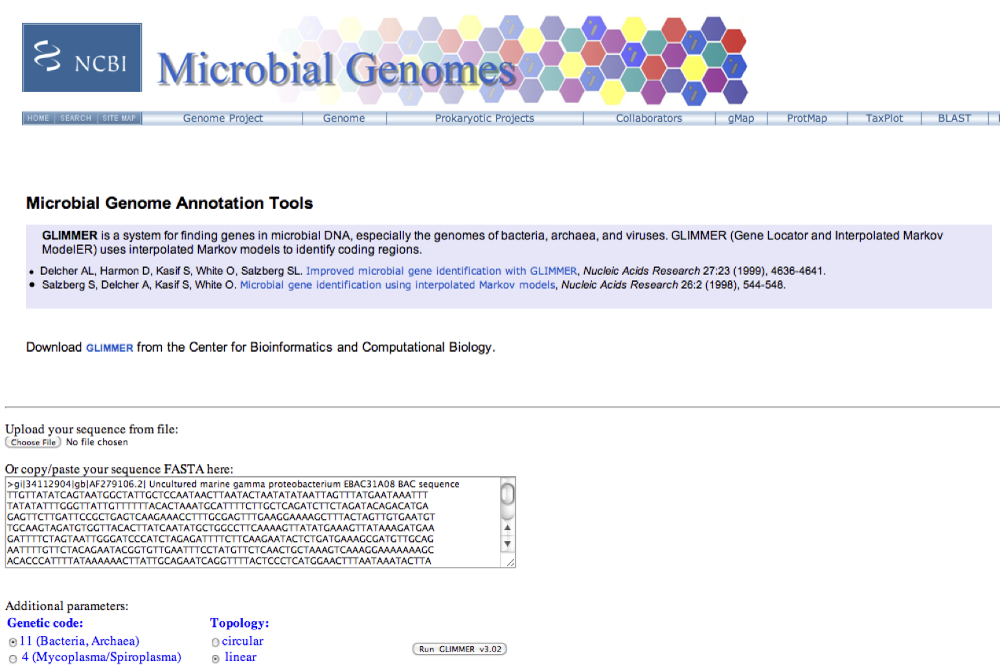
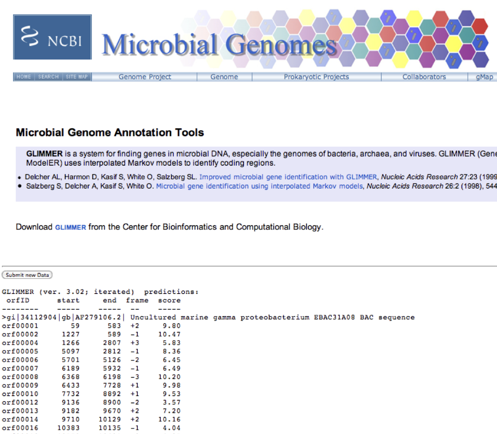
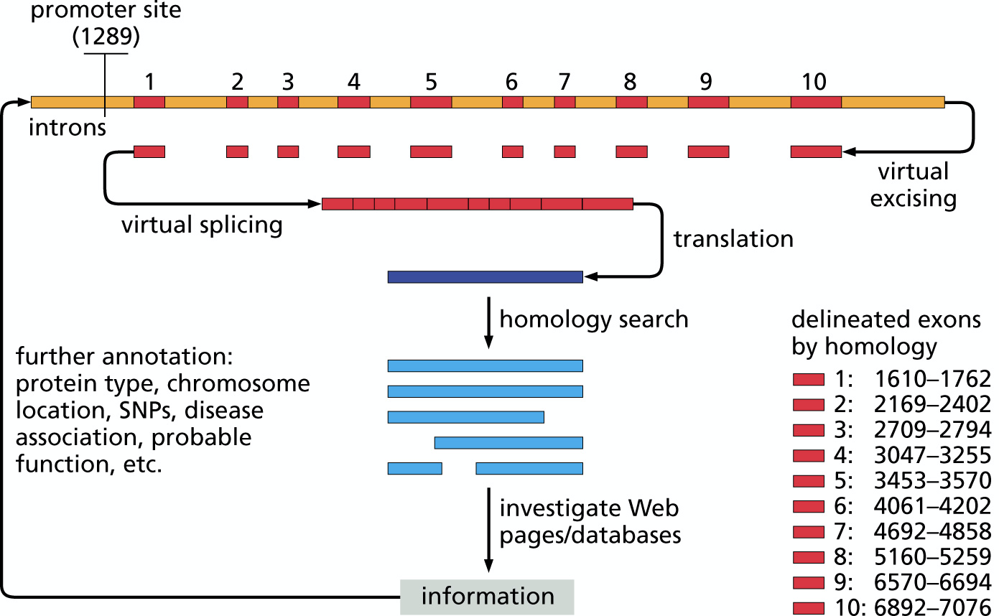

```{r setup, include=FALSE}
knitr::opts_chunk$set(echo = FALSE)
library(tidyverse)
library(Biostrings)
data_path = "~/data"

```

## Goals for today

- Iteration in R (short note)

- Then back to gene finding via Hidden Markov models ...

- Other gene finding approaches and software


## Iteration

- When you want to do something over and over again, without copying the code over and over again

- We've already seen a few examples using either ${\tt for}$ loops or ${\tt apply}$ functions.

- ${\tt for}$ loops are useful if you know _a priori_ how many times you want to execute something. For example, it's not hard to guess the answer to "How many reps of a 20kg weight can Aki benchpress?" Let's count with him.

```{r, echo=TRUE, collapse=TRUE, incremental=FALSE}
for (i in 1:10) {
  cat("\n Good job Aki! You've lifted it ", i, " times.")
}
cat("\nOhhh keep trying. You'll build a muscle someday.")
```

## for loops

```{r, echo=TRUE, collapse=TRUE, incremental=FALSE}
#for (<variable name> in <set of objects> {

  # body of for-loop  

# } #end of for
```

## for loops


- Traditionally, ${\tt for}$ loops in R were discouraged because of speed issues, but this is no longer the case.

```{r, echo=TRUE, collapse=TRUE, incremental=FALSE}
bands <- c("The Jackson Five", "New Kids on the Block", "Boyz II Men", 
           "Justin Bieber", "Aventure", "Backstreet Boys", "Hanson", 
           "112", "NSYNC", "New Edition", "One Direction", "Menudo",
           "BTS", "The Osmonds" )
for (b in 1:length(bands)) {
  if (str_detect(bands[b], "Justin")) {
    cat("\n On a scale from 1 to 100, Aki rates ", bands[b],  " a ",  Inf) 
  } else {
    cat("\n On a scale from 1 to 100, Aki rates ",bands[b],  " a ", sample(c(95:100),1))
  }
} # end of for b
```

## seq_along  

- In the prevous example, we iterated over the integers from $1$ to $length(bands)$. That's perfectly find but can cause problems when the length of the object is empty.

```{r, echo=TRUE, collapse=TRUE, incremental=FALSE}
library(crayon)

pumpkin_carving_successes <- c()
1:length(pumpkin_carving_successes)
for (p in 1:length(pumpkin_carving_successes)) {
  cat("\n Wow Aki that's really ..... ", red("interesting"), ".")
}
```

<figure class="image">
<p float="left">
   
</p>
</figure>

## seq_along

```{r, echo=TRUE, collapse=TRUE, incremental=FALSE}
pumpkin_carving_successes <- c()
seq_along(pumpkin_carving_successes)
for (p in seq_along(pumpkin_carving_successes)) {
  cat("\n Wow Aki that's really ..... ", red("interesting"), ".")
}
```

- This makes more sense.

## The map function

- The purr package from the tidyverse has many nice functions for iteration (Chapter 21)

```{r, echo=TRUE, collapse=TRUE, incremental=FALSE}
# data_path = "/cloud/project/data"
Tara <- read_rds(file.path(data_path, "T_1.0.rds"))
Tara_s <- Tara %>% select( starts_with("Bacteria")) 
Tara_s %>% map_dbl( sum, na.rm = TRUE ) %>% unname %>% print %>% summary
```


## The map function

- The purr package from the tidyverse has many nice functions for iteration (Chapter 21)

```{r, echo=TRUE, collapse=TRUE, incremental=FALSE}
Tara_s %>% map_lgl( ~(sum(.x, na.rm = TRUE) > 50000)) %>% unname %>% print
```

## Iteration of undetermined length

- Sometimes we don't know _a priori_ how many times we need to loop over a body of code.

- In this example, we keep removing the first letter of the string until the total GC content is at least 80%.

```{r, echo=TRUE, collapse=TRUE, incremental=FALSE}
(x <- "ACTTAGACCATGCAGTCATGACTAATGCCGAGG")
percent_GC <- function( s ) { return(str_count(s, "(G|C)")   /   str_length(x) * 100  ) }

while (percent_GC(x) < 80) {
  x <- str_sub(x, 2, str_length(x))
  print(x)
}

```


## Goals for today

- Iteration in R (short note)

- Then back to gene finding via Hidden Markov models ...

- Other gene finding approaches and software


## Addtional issues with gene finding 

- Gene finding in Eukaryota is much different than Prokaryota

- [Gene Finding Software](https://en.wikipedia.org/wiki/List_of_gene_prediction_software)

- _Intrinsic_ versus _extrinsic_ approaches

- HMMs are one example of an intrinsic appraoch. 

- HMMs are not just for protein encoding genes. Also be used to detect: 

  - ribosomal RNA genes (rRNA)
  
  - transfer RNA genes (tRNA)
  
  - small RNAs (incl. microRNAs)
	
  - long nc-RNAs, (ncRNA)

## Gene finding in Eukaryota versus Prokaryota


<figure class="image">
<p float="left">
   
   
</p>
</figure>

<figure class="image">
<p float="right">
   
</p>
</figure>


## Prokaryotic gene finding

- Prokaryotic genomes to be small with little intergenic regions
- ... and often in an operon structure for regulation.
- In comparison, only 2% of vertebrate genomes code for proteins.

<figure class="image">
<p float="center">
   
</p>
</figure>

##  Open reading frames (ORFs)

- Genes are most simply identified by the presence of long open reading frames (ORFs).
- An ORF is defined by a start codon and a stop codon.

- 5'-ATG or 5'-GTG or 5'-TTG start codons and TAA-3', TAG-3', TGA-3' stop codongs.


<figure class="image">
<p float="center">
   
</p>
<caption>DNAlogo for start codons in bacteria E. coli</caption>
</figure>

## Prokaryotic gene finding

- GLIMMER is one of the most famous gene finders for prokaryotes, based on HMMs.


<figure class="image">
<p float="center">
   
     

</p>
</figure>

## Intrinsic vs extrinsic vs expression approaches

 
- Both can be used in both prokaryotic and eukaryotic settings.

- Intrinsic methods summarize genes by their nucleotide frequencies (in only a slightly more complicated manner than we discussed earlier). The disributions are used to identify regions of the target genomes likely to contain a gene.

- Extrinsic methods use sequence alignment algorithms (eg ${\tt blastx}$) to find regions of the genome that have nucleotide patterns very similar to genes from other organisms.

- I don't particularly find the terms extrinsic and intrinsic meaningful. Both techniques bring in information from other organisms but in different ways. They are complementary methods.

- Next generation based RNA-sequencing provides a third method, where sequenced transcripts are mapped back to a genome.


## Hybrid Eukaryotic gene finding

- intrinsic (HMM) and extrinsic with multi-layered HMMs (GRAIL2, FGENESH, GENEID, GENESCAN, GENIE, HMM-gene)

<figure class="image">
<p float="center">
   
</p>
</figure>

## HMMs in R

- Packages include ${\tt depmixS4}$ and ${\tt seqhmm}$.

- ${\tt rhmmer}$ (R HMMer) is a famous package for sequence analysis.


## Points of reflection

- What are some of the limitations of an intrinsic approach for gene finding?

- What are some of the lmitations of an extrinsic approach for gene finding?


## BIOCHEM xxxxx

&copy; M Hallett, 2022 Western University


