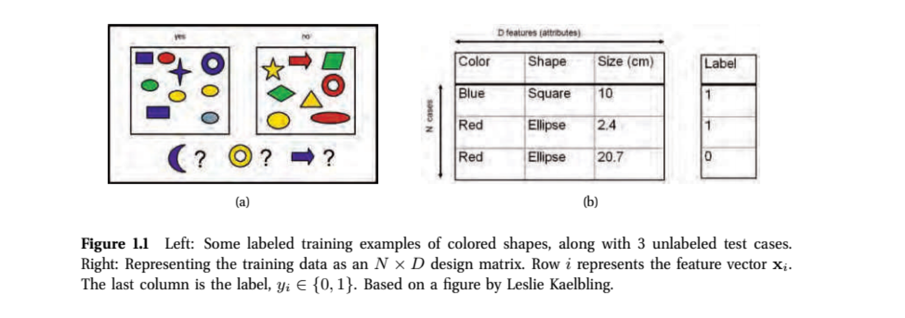
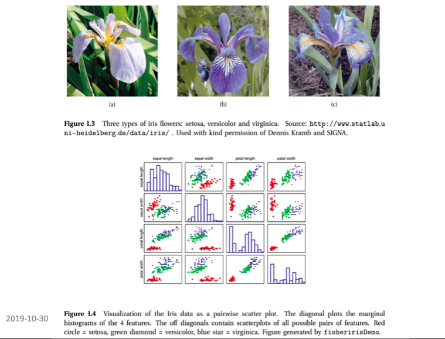
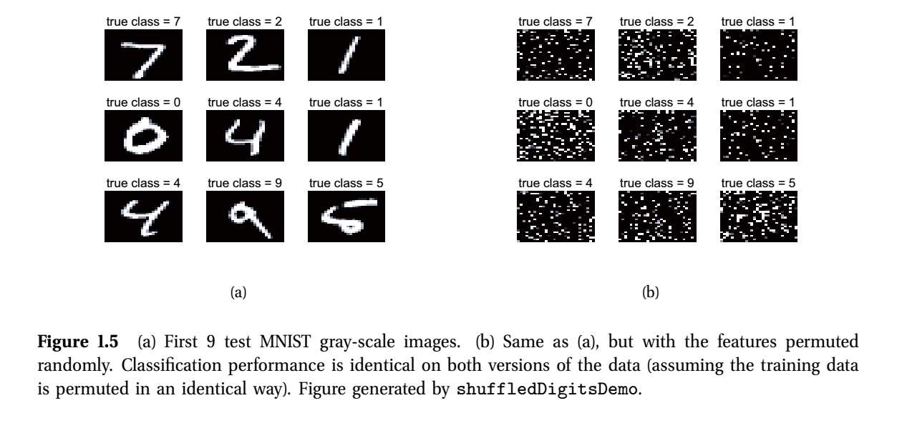
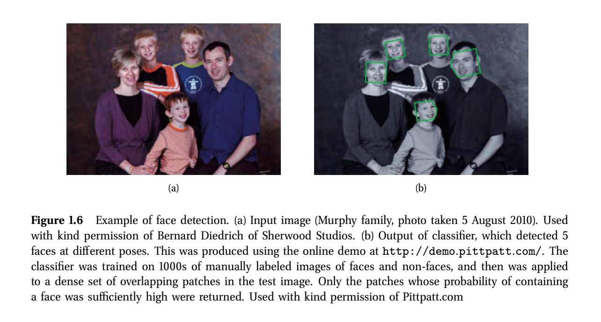
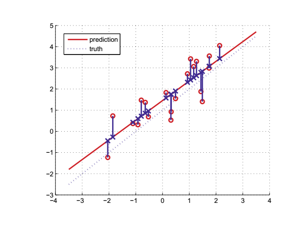

```{r setup, include=FALSE}
knitr::opts_chunk$set(echo = FALSE)
library(tidyverse)
data_path = "~/data"
library(knitr)
df <- tribble( ~input, ~`paired with`, ~output,
              #--------|--------------|--------,
              "x[1]", "\u2192", "y[1]",
              "x[2]", "\u2192", "y[2]",
              "\u2022\u2022\u2022", "\u2022\u2022\u2022", "\u2022\u2022\u2022",
              "x[N]", "\u2192", "y[N]"
               )
df2  <- tribble( ~`height`, ~`weight`, ~`IQ`, ~`education`, ~`paired with`, ~output,
              #--------|--------------|--------,
              "x[1,1]", "x[1,2]","x[1,3]","x[1,4]", "\u2192", "y[1]",
              "x[2,1]", "x[2,2]","x[2,3]","x[2,4]", "\u2192", "y[2]",
              "\u2022\u2022\u2022", "\u2022\u2022\u2022", "\u2022\u2022\u2022", "\u2022\u2022\u2022", "\u2022\u2022\u2022", "\u2022\u2022\u2022",
              "x[N,1]", "x[N,2]","x[N,3]","x[N,4]", "\u2192", "y[N]",
               )
```


## Goals for today


- Finish with sequence alignment 

- Some basic definitions in machine learning

- Supervised vs unsupervised vs reinforcement learning

- Probabilistic perspectives

- k means clustering (unsuperivised)

- Next class: linear models (supervised)

## Global Thermonuclear War

- [War Games](https://www.youtube.com/watch?v=hbqMuvnx5MU&ab_channel=MovieclipsClassicTrailers)

- [Tic Tac Toe](https://www.youtube.com/watch?v=F7qOV8xonfY)

- (In RStudio, you can simply click Session/Interrupt R.)


<figure class="image">
<p float="left">
   
</p>
</figure>
Ti-99/4a


## Supervised learning

- The goal is to learn mappings from the input variables __x__ to the output variables __y__, using a training set consisting of a labelled set of input-output pairs:

```{r, echo=FALSE, collapse=TRUE, incremental=FALSE}
knitr::kable(df, align=c('c', 'c', 'c'))
```

- N is the number of training samples

- For example, $x$ could be the height of $N$ individuals, and $y$ could correspond to their sex. Our goal might be to learn a mapping to predict sex from height.

- Usually, though each observation (row) is comprised of several attributes (variables, columns).


```{r, echo=FALSE, collapse=TRUE, incremental=FALSE}
knitr::kable(df2, align='c')
```

## Design matrix X

- Height, weight, IQ, education status are referred to as __features__, __attributes__ or __covariates__. In tibbles , we call them __variables__.

- We often refer to this feature data as the design matrix $X$:


```{r, echo=FALSE, collapse=TRUE, incremental=FALSE}
knitr::kable(df2[, -c(5,6)], align='c')
```

## Different forms of supervised learning

- Variable $y$ (eg sex) is called the __response__ variable.

- It can have different types.

- __Categorical__ when possible states of $y$ are finite. That is $y \in C$ where $|C|$ is a finite number. For example, $y \in \{ 1, 2, 3 \}$ or $y \in \{ good, bad, ugly \}$, $y \in \{ TRUE, FALSE \}$

- When $y$ is categorical, we say that this is a classification problem.

- When $|C| = 2$, we say it is a _binary classification problem.

- When $|C| > 2$, we say it is a multiclass classification. 

- Sometimes, we have __ordinal__ response variables: categorical variables that are ordered. Eg, $your\_grade \in \{ B, B+, A-, A, A+ \}$.

- Sometimes $y$ can take real values. Eg, $y \in \{ -\infty : +\infty \}$, $y$ is a temperature, $y$ is the number of days to relapse.

- When $y$ is real, we call this a __regression__ problem.

## Supervised learning example

- The goal here is to generalize beyond the training set. 
That is, use the examples in the boxes of (a) and design matrix of (b)
to form general rules that will allow us to classify the purple moon,
yellow donut, and blue arrow.


<figure class="image">
<p float="left">
   
</p>
</figure>

## Essential probability theory

- [Conditional Probability](https://seeing-theory.brown.edu/compound-probability/index.html#section3)

- We have our __training set__ $U$ consisting of mappings from the
input variable $x$ to the output variable $y$. 

- If we are learning a binary classifer, the $C$ is either $0$ or $1$ (good or bad, on or off).

- Ideally, we would like to reason in a sound manner about 

\[
Pr( y | x, U)
\]

- For example, $Pr( y = {\tt  bad~outcome} | x, U )$ 
represents the probability that a woman diagnosed with breast cancer will recur (bad outcome) given 

  - the clinico-pathological and gene expression data for this patient in our ${\tt brca}$ dataset (this is $x$), and

  - a (hopefully large) collection of other cases of women of good and bad outcome with different atttributes (this is $U$, the rest of our ${\tt brca}$ dataset)
  
## Conditional probability

- Notice that 
\[ Pr( y = {\tt bad~outcome} | x, Y ) + Pr (y = {\tt good~outcome} | x, Y ) = 1
\]

- Actually we should probabily write $Pr( y | x, U, {\bf M})$ where
$M$ is the model of how we classify $y$ from $x$ and $U$. For example, via logistic regression which we will look at today.

## Maximum a posterior probability (MAP)

- Recall the question from Michelle about a sort of likelihood/parsimony highbrid. MAP is a common approach; "best guess":
  - if $Pr( y = {\tt good~outcome} | x, U) > Pr(y={\tt bad~outcome} | x, Y)$, choose good. Otherwise bad.

- Let's revisit this puzzle with these concepts in mind.


<figure class="image">
<p float="left">
   
</p>
</figure>

## Some real-world examples of supervised learning

- This data is available in R (${\tt iris}$ variable). From R. Fisher.
The goal is to build a classifier for the three types of irises: setosa, virginica, versicolor.


<figure class="image">
<p float="left">
   
</p>
</figure>


##  Real-world examples of supervised learning

- The features x are sepal length, sepal width, petal length, petal width (x[i, 1], x[i,2], x[i,3], x[i,4]   four attributes). D is the data in the ${\tt iris}$ tibble in R. N, the number of examples in the learning set, is 150.


<figure class="image">
<p float="left">
   
</p>
</figure>

## More examples


<figure class="image">
<p float="left">
   
   
</p>
</figure>

## Regression 

- Recall: Variable $y$ (eg gender) is called the __response__ variable. When $y$ takes real values (eg age, time, temperature), we call this problem a regression. 

<figure class="image">
<p float="left">
   
   
</p>
</figure>


## Unsupervised learning

- Here the training set consists only of the inputs $x$ but no output variables $y$. 


```{r, echo=FALSE, collapse=TRUE, incremental=FALSE}
knitr::kable(df2, align='c')
```

- The goal is to find “interesting” patterns in the data.  This is sometimes called knowledge discovery or data mining.

- We aren’t told what kind of patterns nor how to evaluate the patterns.

- Seems a bit open ended, no?

- It’s best to think of this as you being a very patient open minded parent.

- Perhaps you are speaking with your teenage daughter who is teen-splaining a political issue for your benefit by
	randomly uttering statements about the topic.

- You listen patiently to see if there is an overall pattern emerging from the stream of information.

## Unsupervised learning


2. The unsupervised approach.


- In e-commerce, it is common to cluster users into groups, based on their purchasing or web-surfing behavior, and then
 			to send customized targeted advertising to each group (Berkhin 2006). 

- In astronomy, the autoclass system (Cheeseman et al. 1988) discovered a new type of star,  based on clustering 
		astrophysical measurements.

- In biology, many examples including with protein or gene expression data and DNA-level sequence motif discovery.


- We will look at the k-means  approach for clustering data shortly.

## Reinforcement learning

- It is the subject of much current research.

- The idea is kind of like conditional learning in psychology.

- Your train your computer program to perform certain tasks (eg to drive you to work) by rewarding or punishing it.

- You can ask how do you punish or reward a computer … you can’t … it’s just flowery language to describe how
	your program makes decisions based on trying out different alternaives.

- For example, if you are building a  computerized wheelchair to go down stairs, 
	Your program might start by lurching forward at the top of the stairss. It gets -10 points for rolling end over end down the stairs.
		
- Your program would start again and try rolling very slowly towards. It might make it down 1 stair before falling, so it 	would get -5 points.
		
  - Eventually your program learns to roll forward and backward in tiny increments until it gets to the bottom.

## Points of reflection


## BIOL 480

&copy; M Hallett, 2020 Concordia University


