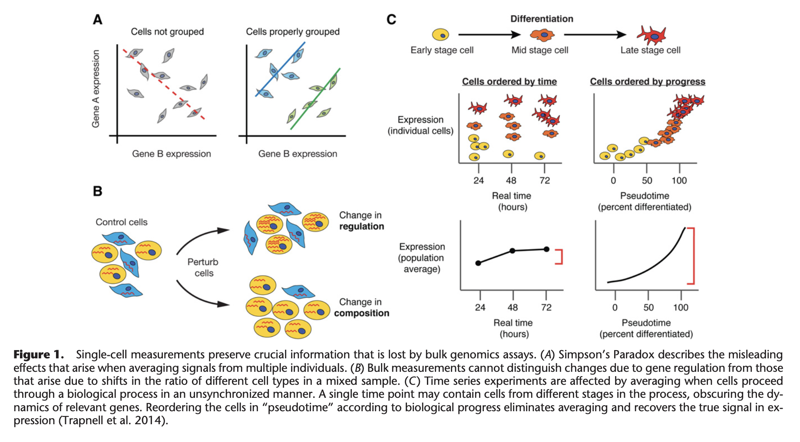
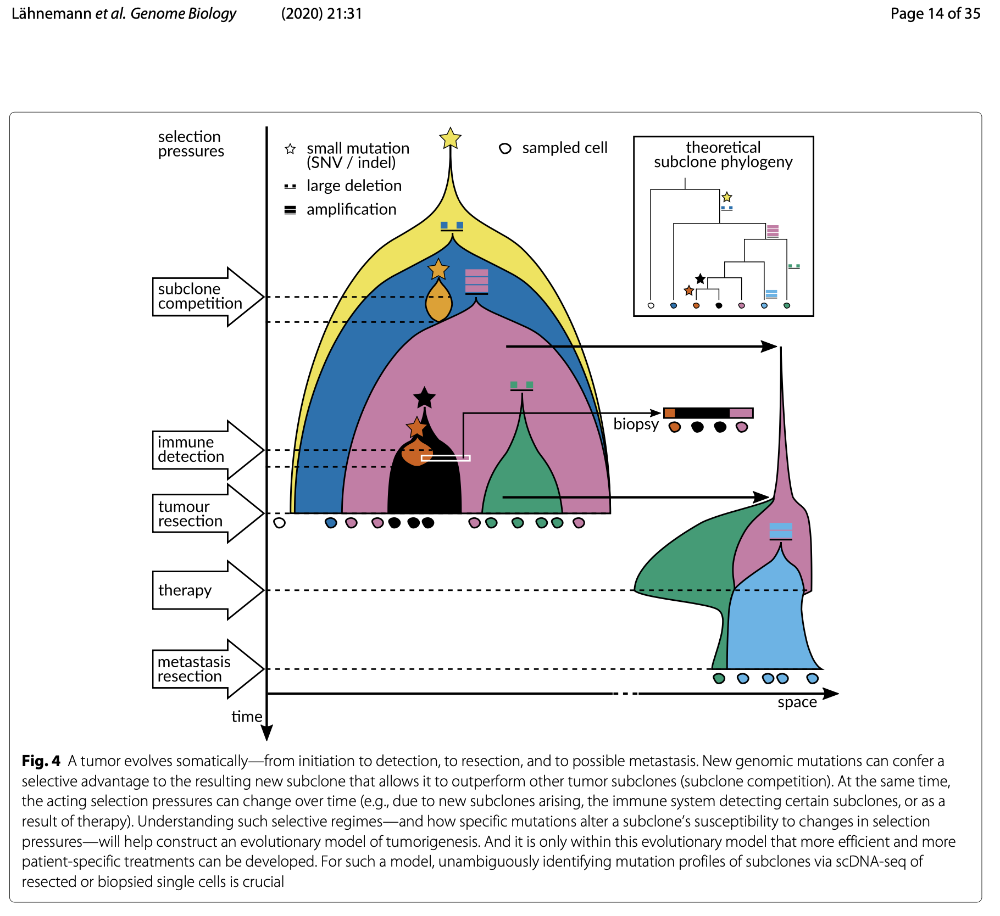

```{r setup, include=FALSE}
knitr::opts_chunk$set(echo = FALSE)
library(tidyverse)
data_path = "~/data"

```


## Goal today

- What is single cell sequencing?

- How does it help

- Discuss the major computational challenges associated with single cell sequencing.

- Short talk about a current project from my lab where we profile Candida albicans at the single cell level.


## Information loss in bulk profiling

<figure class="image">
<p float="center">
   
</p>
<figurecaption>From [Trapnell (2018) Defining cell types and states with single-cell genomes. Genome Research](https://genome.cshlp.org/content/25/10/1491).
</figure>


## scDNA-seq and tumoral evolution

- [Eleven grand challenges in single-cell data science](https://genomebiology.biomedcentral.com/articles/10.1186/s13059-020-1926-6#Sec26)

<figure class="image">
<p float="center">
   
</p>
</figure>

## Single cell in the fungal world

- [Candida albicans single cell project (my lab)](https://youtu.be/udbD0xTuGG8)


## BIOCHEM xxxx

&copy; M Hallett, 2022 Western University


