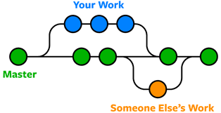
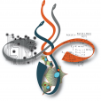

```{r setup, include=FALSE}
knitr::opts_chunk$set(echo = FALSE)
library(tidyverse)
data_path = "~/data"

```


## Tools to facilitate reproducibility

- Where things can go wrong

- Solutions and mitigators


<figure class="image">
<p float="center">
   
</p>

</figure>


## Towards Systems Biology

<figure class="image">
<p float="center">
   
</p>
</figure>

- Systems Commerce, Information Systems, Systems Biology: what advantages does good design have? 


## Reproducibility crisis 

- Reproducibility crisis. The wiki page gives a decent overview to the problem and surveys the major angles for addressing this issue.


- The fundamental observation is that many studies in the literature are not reproducible by third parties.

- Some [disagreement](https://www.pnas.org/content/115/11/2628) as to the severity of the problem or how to deal with the problem.

- What can we do as quantitative life sciencists (data scientists, bioinformaticians, computational biologists)?

## Complete dishonesty

- There are examples of clear dishonesty in life science research.

- [Duke scandal](https://www.nytimes.com/2011/07/08/health/research/08genes.html?_r=2&hp)

- [Elizabeth Holmes and Theranos](https://en.wikipedia.org/wiki/Theranos)

- However issues of reproducibility (or lack thereof) are more insidious.


## The causes of irreproducibility

- Simple clerical mistakes

- Poor or incomplete description of the result

- Poor or incomplete description of method

- Problems (eg technical or selection bias) in profiling

- Inaccessible supporting data incl. training set

- Improper use of training/validation dataset

- Bugs in computer code

- Lack of statistical power in the study

- Improper or naive use of statistics (eg pvalues) [Why most published research findings are false, Ioannidis](https://upload.wikimedia.org/wikipedia/commons/8/8e/Ioannidis_%282005%29_Why_Most_Published_Research_Findings_Are_False.pdf)

- Society and human nature: competition, time constraints, poverty, acknowledegment

- Other?


## How can the quantitative life sciences contribute?

- Bioinformatics' mandatesinclude development of ethical guidelines, standards and education.

- Data science contributes methods for better expressing our results.

- Computational biology continues to improve methodology and integration with solid statistical foundations.

## Incomplete information in manuscript

- For example,

- __Problem__ Poor or incomplete description of the result

- __Problem__ Poor or incomplete description of method

- __Mitigation__  [Distill](https://distill.pub/) A new way of publishing?

- __Mitigation__ [Distill for R](https://rstudio.github.io/distill/)

## Poor description of methodology; lack of code


<figure class="image">
<p float="left">
   
   
</p>
<figurecaption>Left: R notebook; Right: Jupyter notebook </figurecaption>
</figure>

## GIT 

- GIT is software that guarantees persistent and consistent code wtihin collaborative projects.


<figure class="image">
<p float="left">
   
   
</p>
<figurecaption> GIT flow. Nodes represent changes in a file. </figurecaption>
</figure>

##  Bitbucket, Github and other sites

- There are websites that specialize in hosting GIT repositories. This makes your projects accessible everywhere.


<figure class="image">
<p float="left">
   
</p>
<figurecaption> Bitbucket is our labs' choice for day to day operations </figurecaption>
</figure>

## Github, Bitbucket and other sites


<figure class="image">
<p float="left">
   
</p>
<figurecaption> This course is available through Github. </figurecaption>
</figure>


## Acknowledgement


- Outdated method of listing authors 


<figure class="image">
<p float="center">
   
</p>
</figure>


## BIOCHEM xxxx

&copy; M Hallett, 2022 Western University




